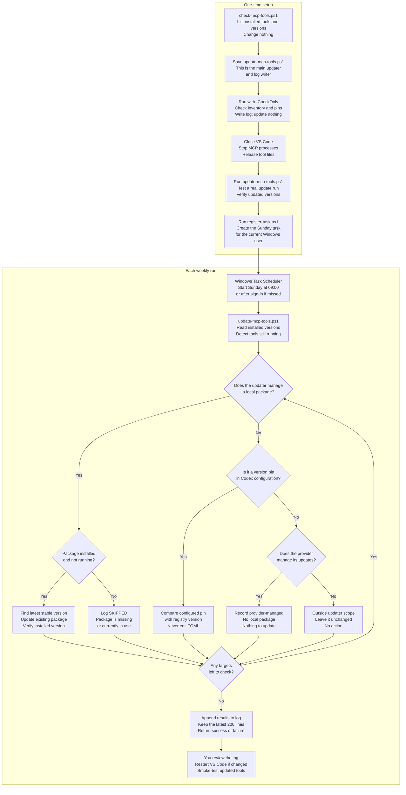

# MCP servers for Business Central AL development

> **About this guide**
>
> This guide helps Business Central AL developers choose, install, configure and verify MCP servers, primarily with Codex on native Windows. It includes a ranked top-15 toolbox, detailed collapsible installation instructions, paste-ready configuration, manual maintenance, optional automatic updates, and a shared agent policy.
>
> **How to use it:** choose the smallest set that answers the task, expand its installation section, complete its prerequisites and verification, then use the configuration and maintenance sections as references. Other agents use the same routing guidance but different configuration and approval mechanisms.
>
> **Validation record — 2026-09-17:** Windows checks used ALTool `18.0.41.39415`, Serena `1.7.0`, `al-mcp-server` `2.5.0`, `BcWordLayout.Mcp` `1.1.0`, `rdl-mcp` `0.1.0`, `mcp-atlassian` `0.23.1`, `@azure-devops/mcp` `2.10.0` and `@playwright/mcp` `0.0.81`, with .NET SDK `10.0.400` and Node `24.20.0`. Scripts and configuration examples were executed or parsed locally; AL argument shapes came from installed server schemas. Authenticated Jira/Azure DevOps/GitHub calls, BC OAuth, profiling/snapshot captures, AL compilation and report rendering were **not** exercised.
>
> **Follow-up — 2026-09-18:** Isolated `config/read` checks on `codex-cli 0.154.0-alpha.6.2` confirmed recursive merging, array replacement, disabled-state inheritance and a task-level enable override. All revised PowerShell, TOML and JSON examples were parsed, local links checked, and the read-only tooling inventory ran successfully. Codex checks used a prerelease; recheck stable behavior and advertised schemas before relying on version-specific details. Recorded versions are observations, not pins.

> **Finalization review — 2026-09-19:** Current primary documentation was rechecked for the revised facts, including the AL tool envelopes, Codex approval behavior and Azure DevOps delivery options. Every external link resolved, and the post-edit structural and code-block checks passed.

## Index

- [Curated toolbox: top 15 MCP servers](#curated-toolbox-top-15-mcp-servers)
- [Related tools and workflow gaps](#related-tools-and-workflow-gaps)
- [Per-server installation](#per-server-installation)
  - [Prerequisites for every server](#prerequisites-for-every-server)
  - [1. Microsoft AL MCP](#install-al)
  - [2. BC Code Atlas](#install-atlas)
  - [3. Serena](#install-serena)
  - [4. AL Dependency MCP](#install-al-dependency)
  - [5. Microsoft Learn](#install-learn)
  - [6. Azure DevOps](#install-azure-devops)
  - [7. Word layouts](#install-word)
  - [8. RDLC / RDL](#install-rdl)
  - [9. Playwright](#install-playwright)
  - [10. BC runtime](#install-bc-runtime)
  - [11. BC Admin Center](#install-bc-admin)
  - [12. Jira](#install-jira)
  - [13. GitHub](#install-github)
  - [14. Performance profiling](#install-profiling)
  - [15. Snapshot debugging](#install-snapshot)
- [Configuration reference](#configuration-reference)
  - [How Codex resolves these blocks](#how-codex-resolves-these-blocks)
  - [User-level TOML](#user-level-toml)
  - [Repository-level TOML](#repository-level-toml)
  - [Other agents](#other-agents)
- [Verification](#verification)
  - [Server smoke checks](#server-smoke-checks)
  - [Report validation](#report-validation)
  - [Troubleshooting](#troubleshooting)
- [Maintenance](#maintenance)
  - [Start with a read-only inventory](#start-with-a-read-only-inventory)
  - [Review and update one server at a time](#manual-per-server-maintenance)
  - [Automate updates on a personal Windows setup](#automatic-updates-optional)
    - [Before you enable automatic updates](#automatic-update-prerequisites)
    - [What the updater changes](#automatic-update-scope)
    - [Limitations to review](#automatic-update-limitations)
    - [Step 1 — save and validate the updater](#store-and-test)
    - [Step 2 — create the weekly task](#register-task)
    - [Step 3 — test, monitor or remove the task](#test-monitor-and-stop)
  - [Inventory installed tooling without changing it](#read-only-tooling-inventory)
- [Paste-ready AGENTS.md policy](#paste-ready-agentsmd-policy)

## Curated toolbox: top 15 MCP servers

| Rank | MCP | Provider | What it gives Codex | When it is useful | Default | Scope |
|---:|---|---|---|---|---|---|
| 1 | [**Microsoft AL MCP Server**](https://learn.microsoft.com/en-us/dynamics365/business-central/dev-itpro/developer/al-agent-tools/al-mcp-server) | Microsoft | Compiles/builds AL, returns exact errors, searches/downloads symbols and publishes apps | Prove a change works against the project's real version and dependencies | **ON** | Global |
| 2 | [**BC Code Atlas**](https://github.com/StefanMaron/bc-code-atlas) | Stefan Maron / community | Explains versioned Microsoft BC source, callers, subscribers and relationships | Discover how standard BC implements a process | **ON** | Global |
| 3 | [**Serena**](https://github.com/oraios/serena) | Oraios / community | Finds definitions/references and edits or renames AL symbols semantically | Understand and safely change local code | **ON** | Repository |
| 4 | [**AL Dependency MCP Server**](https://github.com/StefanMaron/AL-Dependency-MCP-Server) | Stefan Maron / community | Reports loaded `.app` packages, compiled-symbol references, controls and dataitems | Answer the narrow dependency questions `al_symbolsearch` cannot | **ON, three tools** | Global |
| 5 | [**Microsoft Learn MCP**](https://learn.microsoft.com/en-us/training/support/mcp) | Microsoft | Retrieves official AL and BC documentation with citations | Confirm supported contracts and configuration | **ON** | Global |
| 6 | [**Azure DevOps MCP Server**](https://github.com/microsoft/azure-devops-mcp) | Microsoft | Works with Azure Repos, Boards, PRs, pipelines, tests and wiki | Connect a change to its delivery workflow | **OFF, task-driven** | Repository |
| 7 | [**bc-word-layout-mcp**](https://github.com/TKapitan/bc-word-layout-mcp) | Tomas Kapitan / community | Edits and validates BC Word mappings, controls and repeaters | Modify a Word report without breaking mappings | **ON** | Global |
| 8 | [**rdl-mcp (`bethmaloney`)**](https://github.com/bethmaloney/rdl-mcp) | Beth Maloney / community | Inspects/edits RDL datasets, parameters and tablix columns | Make RDLC changes with the full catalog and visual validation | **ON** | Global |
| 9 | [**Playwright MCP**](https://github.com/microsoft/playwright-mcp) | Microsoft | Controls browsers, downloads and screenshots | Reproduce BC web-client behavior or run/download reports | **OFF, task-driven** | Global |
| 10 | [**Business Central MCP Server**](https://learn.microsoft.com/en-us/dynamics365/business-central/dev-itpro/ai/configure-mcp-server) | Microsoft | Reads approved tenant API data and invokes exposed actions | Investigate or perform an approved BC API operation | **OFF, task-driven** | Repository |
| 11 | [**Business Central Admin Center MCP**](https://learn.microsoft.com/en-us/dynamics365/business-central/dev-itpro/administration/administration-center-api-mcp) | Microsoft | Inspects/manages environments, apps and updates | Perform approved environment administration | **OFF, task-driven** | Repository |
| 12 | [**mcp-atlassian — Jira-only Server/Data Center**](https://github.com/sooperset/mcp-atlassian) | sooperset / community | Exposes all available Jira read tools with writes blocked, over a PAT or, on pre-8.14 instances, Basic authentication | Retrieve the authoritative requirement or support history | **ON, read-only** | Global |
| 13 | [**GitHub MCP Server**](https://github.com/github/github-mcp-server) | GitHub | Works with GitHub repositories, issues, PRs and Actions | Work on GitHub clients or investigate BCApps history | **OFF, task-driven** | Global |
| 14 | [**AL performance-profiling MCP proxy**](https://learn.microsoft.com/en-us/dynamics365/business-central/dev-itpro/administration/scheduled-performance-profiler-overview) | Microsoft | Captures executed AL/SQL hot paths and timings | Diagnose a reproducibly slow process | **OFF, support** | Repository |
| 15 | [**AL snapshot-debugging MCP proxy**](https://learn.microsoft.com/en-us/dynamics365/business-central/dev-itpro/developer/devenv-snapshot-debugging) | Microsoft | Captures failing execution for offline analysis | Diagnose a reproducible runtime-only failure | **OFF, support** | Repository |

<br>

> **How to read Default**
>
> **Availability, relevance and authorization are three separate gates**; clearing one never clears the next.
>
> 1. **Availability** — **ON** entries ship enabled. **OFF, task-driven** and **OFF, support** entries are written once but ship `enabled = false`, so they stay out of the catalog until a bounded task needs them.
> 2. **Relevance** — an enabled server is not an instruction to use it. Answer from the narrowest authoritative source, and prefer local evidence over a remote call.
> 3. **Authorization** — credentials and the host's approval controls decide what is permitted. A tool in the catalog is not permission to run it, and reading is not publishing.
>
> **ON** entries remain subject to task authorization. Layout editing requires a copy and [visual validation](#report-validation); Jira ships with server-side read-only mode. **OFF** entries are enabled for bounded tasks involving remote actions, client-specific targets or captured business data.

<br>

> **How to read Scope**
>
> Scope is where this guide *places* a configuration block — not where the executable is installed, and not an access-control boundary.
>
> **Global** means the block is identical everywhere: hosted services (Atlas, Learn, GitHub), local tools that receive their target as a call-time argument (Word, RDLC, Playwright, AL Dependency), single-instance corporate services (Jira), and Microsoft AL MCP, whose launcher picks up the project from the working directory and otherwise defers to `al_addproject`. A client running its *own* Jira is a binding case: give it a distinct server name rather than redefining `[mcp_servers.jira]`.
>
> **Repository** means either the block names a client, tenant, organization or environment (Azure DevOps, BC runtime, Admin Center, the profiling and snapshot proxies), or the server writes into the repository (Serena's `.serena` state). A trusted repository can also override a global entry by redeclaring the same table; see [How Codex resolves these blocks](#how-codex-resolves-these-blocks) for the merge rules.
>
> Global hosted services are reachable from every repository. Enforce the public-host data restrictions in the [shared policy](#paste-ready-agentsmd-policy); configuration placement does not enforce them.

## Related tools and workflow gaps

| Need | Mechanism and limitation |
|---|---|
| Local containers and repeatable build/test flows | [BcContainerHelper](https://github.com/microsoft/navcontainerhelper) through the shell; established Azure Pipelines, or [AL-Go](https://github.com/microsoft/AL-Go) for GitHub. No generic container/CI MCP is necessary. |
| Telemetry investigation | [Azure MCP Monitor](https://learn.microsoft.com/en-us/azure/developer/azure-mcp-server/tools/): optional, task-scoped, read-only; verify subscription/workspace and identity. Example launch arguments: `@azure/mcp@latest server start --namespace monitor --read-only`. |
| Alternative semantic/source interface | [AL LSP](https://learn.microsoft.com/en-us/dynamics365/business-central/dev-itpro/developer/devenv-al-tool#al-lsp) speaks LSP, not MCP. The experimental [al-mcp-bridge](https://github.com/ChristianHovenbitzer/al-mcp-bridge) overlaps Serena. The [Atlas CLI skill](https://github.com/StefanMaron/bc-code-atlas/tree/master/skills/bc-code-atlas-cli) is an alternative to Atlas MCP; avoid duplicate connections. |
| Tests, IDs, translations and page structure | ALTool exposes `al_run_tests`, `al_getnextobjectid`, `al_searchtranslations`/`al_writetranslation` and `al_inspectpage` — but a suggested ID is not a reservation, an XLIFF write is not a review, `al_inspectpage` reads source rather than rendered UI, and a compile is not a test run. Keep the team's test infrastructure, ID registry, translation review and executed UI checks. |
| Report visual regression | Layout tools + compilation + representative sandbox output + every-page comparison. No listed MCP guarantees BC rendering fidelity. |

## Per-server installation

### Prerequisites for every server

Complete only these prerequisites before configuring a server:

1. Install the latest stable [Visual Studio Code](https://code.visualstudio.com/) and the [OpenAI Codex extension](https://marketplace.visualstudio.com/items?itemName=openai.chatgpt), then sign in to Codex. Use stable releases by default; pins are optional for compatibility or reproducibility. This guide configures the extension; no separate Codex CLI installation is required.
2. Work in the execution environment where the extension runs. Native Windows, WSL and remote VS Code each have separate executables, environment variables and configuration.
3. In the Codex extension, open the gear menu and select **Codex Settings → Open config.toml**. Create the file if absent and back it up before editing. Merge server blocks without replacing model, trust or unrelated settings; each server table may occur only once.
4. Put global servers — including Microsoft AL MCP — in user configuration, and client- or environment-specific servers in the trusted repository's `.codex/config.toml`.
5. Store credentials outside committed TOML, using the host credential store or an approved secret manager where supported. Windows user environment variables are plaintext persistence, not a secrets vault; fully restart the host after changing them. Use least-privilege accounts and verify the intended tenant, environment, company, organization or repository before connecting.
6. Merge the [AGENTS.md policy](#paste-ready-agentsmd-policy) into repository-root `AGENTS.md` when sharing it with Codex and GitHub Copilot. For Codex-only user defaults, use `%USERPROFILE%\.codex\AGENTS.md`; Copilot does not automatically read that Codex-specific location. Preserve existing instructions. The shared policy explains tool routing, MCP boundaries and agent operating rules that tool filters cannot enforce; the installation and TOML examples in this guide configure Codex.

For human-review settings, see [How Codex resolves these blocks](#how-codex-resolves-these-blocks).

Everything else is server-specific. Expand the relevant server below; each section contains prerequisites, its complete Codex configuration and a verification sequence. Ranks 6, 9–11 and 13–15 remain disabled until a bounded task needs them. Serena can also be enabled occasionally; see its [activation guidance](#install-serena). For other hosts, translate the examples using [Other agents](#other-agents).

**Version convention:** install the latest stable, non-prerelease package supported by your project. `uvx` examples use `--prerelease disallow`; .NET commands omit `--prerelease`. npm's `latest` tag is publisher-controlled, so inspect `npm.cmd view PACKAGE@latest version` before using it. If it names a prerelease, select the newest non-prerelease release explicitly. [uv tools](https://docs.astral.sh/uv/guides/tools/), [npm tags](https://docs.npmjs.com/cli/commands/npm-dist-tag)

**Maturity exceptions:** RDL's stable-numbered `0.1.0` is still Alpha, and the profiling/snapshot agent features require a preview BC target. Do not change the project's runtime just to enable them.

<dl>
<dd>
<a id="install-al"></a>
<details>
<summary><strong>1. Microsoft AL MCP Server</strong></summary>

#### Prerequisites

- Install Microsoft's [AL Language extension](https://marketplace.visualstudio.com/items?itemName=ms-dynamics-smb.al).
- Open an AL workspace containing `app.json`. Read its runtime, application, platform, target, dependencies, workspace settings, relevant `launch.json`, rulesets and CI configuration. Treat CI as the final authority when local build inputs differ.
- Install the latest stable supported [.NET SDK](https://dotnet.microsoft.com/en-us/download/dotnet). The installed ALTool `18.0.41.39415` includes both `net8.0` and `net10.0` assets. The selected framework requires matching **Microsoft.NETCore.App** and **Microsoft.AspNetCore.App** runtimes; older installs may still need patched .NET 8 runtimes. Inspect the installed `*.runtimeconfig.json` rather than assuming only one framework is supported. Leave `DOTNET_ROLL_FORWARD` unset.
- Verify the SDK and matching runtimes:

  ```powershell
  dotnet --list-sdks
  dotnet --list-runtimes
  ```

- Check `dotnet nuget list source`. Ensure an enabled source supplies `Microsoft.Dynamics.BusinessCentral.Development.Tools`. Use an approved company mirror or, when policy permits, add `nuget.org` with `dotnet nuget add source https://api.nuget.org/v3/index.json --name nuget.org`. Preserve company mappings and do not overwrite `%APPDATA%\NuGet\NuGet.Config`.
- Download the project's correct Microsoft and third-party/PTE symbols so `.alpackages` is complete before validation.

#### Install ALTool

Install ALTool. For an existing installation, use `dotnet tool update`:

```powershell
dotnet tool install --global Microsoft.Dynamics.BusinessCentral.Development.Tools
if ($LASTEXITCODE -ne 0) { throw 'Command failed; resolve the error before continuing.' }
```

For a team-managed installation, add `--version VERSION` and maintain the reviewed pin.

Reopen PowerShell and verify:

```powershell
Get-Command al
al --version
dotnet tool list --global
```

The user PATH must include `%USERPROFILE%\.dotnet\tools`. Add it through Windows user environment settings without replacing the existing PATH, then restart VS Code.

Record the installed version. The global ALTool bundles its own compiler and does not depend on the VS Code extension's versioned executable path. Match compiler/analyzer/build inputs to each repository's CI; use a repository-specific tool path where necessary.

#### Create the project-aware launcher

ALTool `18.0.41.39415` accepts `launchmcpserver` without positional projects and lets an agent add them later with `al_addproject`, so `command = "al"` with explicit arguments also works. The launcher below selects projects from the host's working directory at each start. Outside an AL folder it reports that on stderr and starts the server projectless by default, which suits VS Code; set `AL_MCP_REQUIRE_PROJECT = "1"` to fail fast instead, as the Codex configuration below does. Earlier ALTool builds rejected projectless launches; verify this behavior when supporting another tool version, and require a project there.

Create `%LOCALAPPDATA%\BC-Tooling\al-mcp-launch.ps1` with the following content. Create the directory if absent and back up an existing launcher before replacing it.

```powershell
$ErrorActionPreference = 'Stop'
try {
    $alExecutable = Get-Command al -CommandType Application -ErrorAction Stop |
        Select-Object -First 1 -ExpandProperty Source
    # VS Code user-scope stdio servers inherit the extension host cwd, not the workspace folder.
    $projectRoot = [Environment]::CurrentDirectory
    $alProjects = @()
    if ($projectRoot -and (Test-Path -LiteralPath $projectRoot -PathType Container)) {
        if (Test-Path -LiteralPath (Join-Path $projectRoot 'app.json') -PathType Leaf) {
            $alProjects = @($projectRoot)
        } else {
            $alProjects = @(Get-ChildItem -LiteralPath $projectRoot -Directory -ErrorAction SilentlyContinue |
                Where-Object { Test-Path -LiteralPath (Join-Path $_.FullName 'app.json') -PathType Leaf } |
                Sort-Object FullName | Select-Object -ExpandProperty FullName)
        }
    }
    if ($alProjects.Count -eq 0) {
        # Codex tracks the project through cwd, so opt in there to keep the old fail-fast signal.
        if ($env:AL_MCP_REQUIRE_PROJECT -in @('1', 'true', 'yes')) {
            throw "No AL project found under '$projectRoot'. Open a folder containing app.json or immediate child AL projects."
        }
        [Console]::Error.WriteLine("No AL project discovered under '$projectRoot'. Starting server without projects; use the al_addproject tool to load one.")
        & $alExecutable launchmcpserver --transport stdio
    } else {
        & $alExecutable launchmcpserver @alProjects --transport stdio
    }
    exit $LASTEXITCODE
} catch {
    [Console]::Error.WriteLine($_.Exception.Message)
    exit 1
}
```

Launch this script in a new PowerShell process, as configured above. It uses the process working directory because Windows PowerShell 5.1 can reset its provider location on startup paths containing square brackets. This launcher selects the working directory when it contains an `app.json` file; otherwise it selects immediate child AL project folders, and when neither matches it starts projectless rather than exiting. `-PathType Leaf` excludes directories named `app.json`. It checks file presence, not manifest validity: ALTool can start successfully with no loaded projects after a manifest error, so verify the intended projects after startup — a projectless start is never assumed to be the intended one. Leave parsing to ALTool; the checked version accepts comments and trailing commas that a stricter JSON precheck can reject.

The two hosts need different behavior here, which is why the fail-fast is opt-in rather than removed. Both the Codex CLI and the Codex VS Code extension bind the server's working directory to the folder you opened, so a projectless start there almost always means the wrong folder — failing loudly is the useful signal. A **user-scope** VS Code server started by GitHub Copilot instead inherits the extension host's working directory, observed as the Windows profile root rather than the workspace, so the same failure is pure noise and takes every AL tool down with it. Set `AL_MCP_REQUIRE_PROJECT` to `1`, `true` or `yes` (matched case-insensitively) to restore the hard failure; leave it unset for Copilot. The check writes to stderr, where ALTool already emits its own banner and `info:` logs; stdout carries only JSON-RPC and stays clean either way.

Confirm which of those two cases you are in rather than inferring it from the host name: ALTool records a `Working Directory:` and a `Projects:` line for every start in `%LOCALAPPDATA%\Microsoft\ALLanguageServer\almcp.log`. `Projects: (none)` on a start you expected to be project-bound means the working directory was not the AL folder. A launcher that throws never reaches ALTool, so it leaves no entry in that log at all — read the host's own MCP output for those failures.

Argument arrays preserve spaces and `!` in paths. For deeper layouts, open the actual AL project folder. A root manifest takes precedence when selecting projects, but ALTool can recursively discover `.al` files inside nested child folders; root selection does not isolate source files. With multiple immediate child projects, confirm the default project before symbol research. Give a workspace its own launcher and repository-scoped configuration only when it requires another project set, package cache, ruleset or compiler.

#### Configure and verify Microsoft AL MCP

Merge this block into the **user-level** `%USERPROFILE%\.codex\config.toml` so one entry serves every AL repository. A trusted repository needing another project set, package cache, ruleset or compiler can override matching values by redeclaring `[mcp_servers.al]` in its own `.codex/config.toml`; see [How Codex resolves these blocks](#how-codex-resolves-these-blocks) for the merge rules, and check inherited `cwd`, environment variables, tool filters, timeouts and approval settings when changing build inputs. Because Codex binds the working directory to the opened folder, the block below sets `AL_MCP_REQUIRE_PROJECT = "1"`: in a folder without a root or immediate-child `app.json` file, the launcher exits with a message and Codex reports a startup failure — the expected cost of global scope, and the signal that you opened the wrong folder. Drop that variable to let the server start with no projects instead, and then confirm the loaded projects before trusting any symbol or diagnostic result.

TOML does not expand `%LOCALAPPDATA%` or `$env:LOCALAPPDATA` in strings, so the launcher uses an absolute path. Store `al-mcp-launch.ps1` locally on the same Windows machine that runs Codex, then replace `YOUR-USER` below with the Windows profile name for that machine. `[mcp_servers.al.env]` adds variables rather than replacing the environment, so `PATH` survives and `Get-Command al` still resolves the global tool; `env_vars` remains the separate allowlist for forwarding an existing host variable.

```toml
[mcp_servers.al]
command = "powershell.exe"
args = ["-NoProfile", "-ExecutionPolicy", "Bypass", "-File", "C:/Users/YOUR-USER/AppData/Local/BC-Tooling/al-mcp-launch.ps1"]
startup_timeout_sec = 30

[mcp_servers.al.env]
AL_MCP_REQUIRE_PROJECT = "1"

[mcp_servers.al.tools.al_publish]
approval_mode = "prompt"
```

1. Open the folder containing `app.json`, confirm the project/CI inputs listed in the prerequisites, and run **AL: Download Symbols** if `.alpackages` is incomplete.
2. Restart Codex and verify each intended project with `al_getpackagedependencies`, passing its absolute `projectPath`.
3. Validate the loaded workspace with `al_compile`: set the top-level `enableCodeAnalysis` and `codeAnalyzers` parameters to match CI, and set `onlyErrors = false` to retain warnings. This tool accepts neither `projectPath` nor `scope`. For a selected-project build, use `al_build` with `scope = "current"` and `projectPath`; it also produces an `.app`.
4. Search with bounded `al_symbolsearch` calls. In the AL MCP Server, wrap `query` and `filters` under `parameters`, and set `filters.scope` deliberately to `"project"`, `"dependencies"` or `"all"`. `filters.source` is not part of this tool's documented filter set. Similar editor-native AL tools can use a different call envelope, so follow the schema exposed by the active host.
5. Repeat project verification in a second AL repository to confirm that the global launcher follows the working directory. Publishing is not an installation check.

> **Sources:** [Microsoft AL MCP Server](https://learn.microsoft.com/en-us/dynamics365/business-central/dev-itpro/developer/al-agent-tools/al-mcp-server), [`al_compile` reference](https://learn.microsoft.com/en-us/dynamics365/business-central/dev-itpro/developer/al-agent-tools/al-tool-compile), [`al_symbolsearch` reference](https://learn.microsoft.com/en-us/dynamics365/business-central/dev-itpro/developer/al-agent-tools/al-tool-symbol-search)

</details>
</dd>

<dd>
<a id="install-atlas"></a>
<details>
<summary><strong>2. BC Code Atlas</strong></summary>

#### Prerequisites

- Confirm network access to the [hosted Atlas service](https://github.com/StefanMaron/bc-code-atlas), or deploy a reviewed self-hosted instance when proprietary source must be indexed.
- Determine the exact Business Central build and localization required by the project; do not substitute a nearby version.
- Use the public host only for Microsoft source; never send client source, confidential identifiers, business data or secrets.

#### Setup and verification

The public hosted server requires no local package. Merge this block into `%USERPROFILE%\.codex\config.toml`:

```toml
[mcp_servers.bc-code-atlas]
url = "https://bc-code-atlas.stefanmaron.dev/mcp"
```

Restart Codex, list warm builds, select the exact build/localization and retrieve a known Microsoft object. On versioned search, graph and source calls, pass `country` and the returned `commit_sha` as `version`, not the version string. Pass `languages = ["al"]` to `bcatlas_search`; graph and source tools do not accept that argument. Resolving a build does not warm it: request and poll for the exact build only if it is absent from the warm list. Never substitute a nearby build.

> **Source:** [BC Code Atlas](https://github.com/StefanMaron/bc-code-atlas)

</details>
</dd>

<dd>
<a id="install-serena"></a>
<details>
<summary><strong>3. Serena</strong></summary>

#### Prerequisites

- Install [uv](https://docs.astral.sh/uv/getting-started/installation/) through your organization's software center or run `winget install --id astral-sh.uv -e`.
- Reopen PowerShell and verify `uv --version` and `uvx --version`.
- Confirm access to Serena's package and language-server download sources, then open the intended AL project folder.

#### Setup and verification

Install Serena, reopen PowerShell and initialize it. `uv` can provision a compatible Python (Serena 1.7.0 supports Python 3.11–3.14), so a separately installed system Python is not required:

```powershell
uv tool install --prerelease disallow serena-agent
if ($LASTEXITCODE -ne 0) { throw 'Command failed; resolve the error before continuing.' }
uv tool update-shell
if ($LASTEXITCODE -ne 0) { throw 'Command failed; resolve the error before continuing.' }
uv tool list
if ($LASTEXITCODE -ne 0) { throw 'Command failed; resolve the error before continuing.' }
```

Reopen PowerShell so the PATH change is available, then initialize Serena:

```powershell
serena init
if ($LASTEXITCODE -ne 0) { throw 'Command failed; resolve the error before continuing.' }
```

Optionally pin `serena-agent==VERSION` when compatibility or reproducibility requires it. Ensure `%USERPROFILE%\.local\bin` is on the user PATH. Do not enable Serena in the user-level `%USERPROFILE%\.codex\config.toml`; instead:

1. Open the root of the AL repository that should use Serena.
2. Create `.codex` in that repository if it does not exist.
3. Merge the following block into `<repository>/.codex/config.toml`; do not replace other project settings.
4. Trust the repository when Codex prompts. Codex loads project-scoped configuration only for trusted projects. See the [Codex configuration reference](https://learn.chatgpt.com/docs/config-file/config-reference).

```toml
[mcp_servers.serena]
command = "serena"
args = ["start-mcp-server", "--project-from-cwd", "--context=codex", "--add-mode", "no-memories"]
startup_timeout_sec = 60
```

Remove an enabled user-level Serena entry or leave it disabled. If it is disabled globally, the repository block inherits that state: add `enabled = true` there only when Serena is needed, then remove that override to restore the inherited disabled state. Without a global entry, the shown repository block is enabled by default; add `enabled = false` if you prefer occasional activation.

Restart Codex for the task, let the initial backend download finish, confirm the intended project and read startup instructions. Serena 1.7.0 defaults to AL extension `18.0.2242655`; set `ls_specific_settings.al.al_extension_version` in `.serena/project.yml` only when a particular backend generation is required. Verify with `get_current_config` and `get_symbols_overview` on an existing AL file, then compile consequential edits with the project compiler.

> **Sources:** [Serena](https://github.com/oraios/serena), [AL backend](https://github.com/oraios/serena/blob/main/src/solidlsp/language_servers/al_language_server.py)

</details>
</dd>

<dd>
<a id="install-al-dependency"></a>
<details>
<summary><strong>4. AL Dependency MCP Server</strong></summary>

#### Prerequisites

- Install [Node.js LTS](https://nodejs.org/en/download) through your organization's software center or run `winget install --id OpenJS.NodeJS.LTS -e`.
- Install the [.NET 8 SDK or later](https://dotnet.microsoft.com/en-us/download/dotnet/8.0). The server uses AL CLI tooling to extract symbols from compiled packages.
- Reopen PowerShell and verify `node --version`, `npm.cmd --version` and `dotnet --version`.
- Check `dotnet nuget list source`. Ensure an enabled source supplies the AL tooling packages required by the server. Use an approved company mirror or, when policy permits, add `nuget.org` without replacing existing company source mappings.
- Confirm npm registry access and populate the intended project's `.alpackages` folder with the exact Microsoft and third-party/PTE package versions.

#### Setup and verification

Inspect the current npm tag with `npm.cmd view al-mcp-server@latest version`. If it is a non-prerelease, install the package, reopen PowerShell and verify it:

```powershell
npm.cmd install --global al-mcp-server@latest
if ($LASTEXITCODE -ne 0) { throw 'Command failed; resolve the error before continuing.' }
npm.cmd list --global al-mcp-server --depth=0
if ($LASTEXITCODE -ne 0) { throw 'Command failed; resolve the error before continuing.' }
```

Optionally replace `latest` with a reviewed exact version for compatibility or reproducibility. Ensure the npm global prefix from `npm.cmd prefix --global` is on the user PATH. Then merge this block into `%USERPROFILE%\.codex\config.toml`:

```toml
[mcp_servers.al-dependency]
command = "cmd"
args = ["/d", "/c", "al-mcp-server"]
startup_timeout_sec = 60
enabled_tools = ["al_packages", "al_find_references", "al_search_object_members"]
```

`cmd /d /c` launches the npm-generated Windows shim. Verify with `al_packages` using `action = "load"`, `path` set to the absolute `.alpackages` path and `autoDiscover = false`; then use `action = "list"`. Use `forceReload = true` when replacing the loaded inventory, including when switching projects, because ordinary loads retain existing data.

Confirm the expected publishers, app IDs and exact versions. Version `2.5.0` chooses the highest package version per publisher/name, breaking equal-version ties by file modification time; it does not select the version declared by your project. Isolate the intended package versions before loading. A fresh list can be empty until loaded.

References are declaration-level metadata, never call sites or subscriptions. Use `al_search_object_members` only with `memberType = "controls"` or `"dataitems"`.

> **Source:** [AL Dependency MCP Server](https://github.com/StefanMaron/AL-Dependency-MCP-Server)

</details>
</dd>

<dd>
<a id="install-learn"></a>
<details>
<summary><strong>5. Microsoft Learn MCP</strong></summary>

#### Prerequisites

- Confirm HTTPS access to the [Microsoft Learn MCP endpoint](https://learn.microsoft.com/en-us/training/support/mcp). No local runtime or separate Microsoft Learn account is required.

#### Setup and verification

No local package is required. Merge this block into `%USERPROFILE%\.codex\config.toml`:

```toml
[mcp_servers.microsoft-learn]
url = "https://learn.microsoft.com/api/mcp"
```

Restart Codex and request the official AL `DataTransfer` documentation. The result must contain documentation content and a Microsoft Learn URL. Use this server for supported contracts and documentation, not source-code discovery.

> **Source:** [Microsoft Learn MCP](https://learn.microsoft.com/en-us/training/support/mcp)

</details>
</dd>

<dd>
<a id="install-azure-devops"></a>
<details>
<summary><strong>6. Azure DevOps MCP Server</strong></summary>

#### Prerequisites

- Install [Node.js LTS (20 or later)](https://nodejs.org/en/download) and verify `node --version` and `npx --version`.
- Confirm this is an **Azure DevOps Services** organization; the server does not support on-premises Azure DevOps Server.
- Use an account with access to the intended organization and repositories. For Azure CLI authentication, install the [Azure CLI](https://learn.microsoft.com/en-us/cli/azure/install-azure-cli-windows) and sign in to the intended tenant.

> **Hosted or local?** Microsoft recommends its hosted [Remote MCP Server](https://learn.microsoft.com/en-us/azure/devops/mcp-server/remote-mcp-server?view=azure-devops) first when the client supports its Microsoft Entra authentication flow, because it removes the need to run a local Node.js process or manage server updates. Check the live compatibility table before setup: use the hosted instructions if your Codex version is supported; otherwise use the local stdio configuration below, which is Microsoft's documented Codex path at the date of this review. The hosted toolsets and local domains are not named identically, so confirm that the required capabilities are available before switching.

#### Setup and verification

1. In each Azure DevOps-backed AL repository, add this **disabled-by-default** block to `.codex/config.toml`. Replace `YOUR-ORGANIZATION` with the organization name from `https://dev.azure.com/YOUR-ORGANIZATION`:

   ```toml
   [mcp_servers.azure-devops]
   enabled = false
   command = "cmd"
   args = ["/d", "/c", "npx", "-y", "@azure-devops/mcp@latest", "YOUR-ORGANIZATION", "-d", "core", "work", "work-items", "repositories", "pipelines"]
   startup_timeout_sec = 60
   default_tools_approval_mode = "writes"
   ```

2. Set `enabled = true` only for a repository/PR/work-item/pipeline task and restart Codex. On the first tool call, sign in in the browser with the account that can access that organization. If your workstation already uses Azure CLI, run `az login` with the intended tenant/account and append `"--authentication", "azcli"` to the argument array.
3. Verify with: **“List my Azure DevOps projects; make no changes.”** The full domain set is `core`, `work`, `work-items`, `repositories`, `wiki`, `pipelines`, `search`, `test-plans` and `advanced-security`; add `wiki`, `search`, `test-plans` or `advanced-security` only when required, because loading every domain creates unnecessary tools and context.

> **Sources:** [Microsoft Azure DevOps MCP Server — Codex setup](https://github.com/microsoft/azure-devops-mcp/blob/main/docs/GETTINGSTARTED.md), [Remote MCP Server guidance](https://learn.microsoft.com/en-us/azure/devops/mcp-server/remote-mcp-server?view=azure-devops)

</details>
</dd>

<dd>
<a id="install-word"></a>
<details>
<summary><strong>7. bc-word-layout-mcp</strong></summary>

#### Prerequisites

- Install the [.NET 10 SDK](https://dotnet.microsoft.com/en-us/download/dotnet/10.0), or download the upstream self-contained Windows release when .NET 10 cannot be installed.
- Work on a DOCX backup. Microsoft Word is optional for structural editing but supplies the verified PDF-conversion path on supported Windows systems.
- Have an AL project and approved Business Central sandbox for final compilation and representative-data rendering.

#### Setup and verification

1. Add this global block to `%USERPROFILE%\.codex\config.toml`:

   ```toml
   [mcp_servers.bc-word-layout]
   command = "dnx"
   args = ["BcWordLayout.Mcp", "--yes"]
   startup_timeout_sec = 60
   ```

2. The unversioned `dnx` entry resolves the latest stable package. Optionally use `BcWordLayout.Mcp@VERSION` to pin for compatibility or reproducibility. Alternatively, install globally with `dotnet tool install --global BcWordLayout.Mcp` and use `command = "bc-word-layout-mcp"` with no arguments; add `--version VERSION` only when a pin is needed. Without .NET 10, use the self-contained Windows release, keep its whole extracted directory together, and configure its `BcWordLayout.McpHost.exe` path. Windows x64/arm64 is the supported platform.

3. Restart Codex and verify on a **copy**: **“Inspect this DOCX with `get_layout_info`; make no changes.”** For edits, follow [report validation](#report-validation). Set `enabled = false` between layout tasks if preferred.

4. Run `validate_layout` and inspect mock-preview images before the shared final checks. Without a converter, `preview_layout` returns a merged DOCX with `conversionOk: false`. Microsoft Word supplies the supported Windows PDF path; LibreOffice is not verified end to end upstream. Upstream fidelity validation covers BC 28.0 and 28.3.

5. Optionally install the companion skills `al-word-layout` (intended workflow and supported matrix) and `al-word-layout-design` (archetype skeletons and BC document conventions). The server works without them, but upstream reports that agents drive the tools noticeably better with them. Copy `skills/al-word-layout/` and `skills/al-word-layout-design/` from the repository into your agent's skills directory.

> **Source:** [bc-word-layout-mcp upstream installation](https://github.com/TKapitan/bc-word-layout-mcp#install)

</details>
</dd>

<dd>
<a id="install-rdl"></a>
<details>
<summary><strong>8. rdl-mcp (`bethmaloney`)</strong></summary>

#### Prerequisites

- Install [uv](https://docs.astral.sh/uv/getting-started/installation/) and verify `uvx --version`.
- Preserve a backup copy of the `.rdl` or `.rdlc` file.
- Have the AL project and an approved BC sandbox available for compilation and real report rendering; the MCP cannot prove pagination fidelity.

#### Setup and verification

1. PyPI classifies `rdl-mcp` **0.1.0** as **Alpha**. Add this global block to `%USERPROFILE%\.codex\config.toml`; it resolves the latest non-prerelease package:

   ```toml
   [mcp_servers.rdl]
   command = "uvx"
   args = ["--prerelease", "disallow", "rdl-mcp@latest"]
   startup_timeout_sec = 60
   ```

2. Restart Codex and verify on a copied `.rdl`/`.rdlc`: **“Describe this report, its datasets and columns; make no changes.”**
3. Keep the full tool catalog, including edit tools, without a tool-name allowlist. Follow [report validation](#report-validation) and inspect the XML diff. Set `enabled = false` between report tasks if preferred.
4. Treat the alpha server as experimental for BC. Do not infer support for matrices, charts, complex grouping, expressions or pagination from successful XML validation. Its generic SSRS dataset/stored-procedure tools do not generate the AL report dataset.
5. Optionally change `rdl-mcp@latest` to `rdl-mcp==VERSION` for compatibility or reproducibility.

> **Sources:** [rdl-mcp upstream repository](https://github.com/bethmaloney/rdl-mcp), [PyPI release and Alpha classification](https://pypi.org/project/rdl-mcp/)

</details>
</dd>

<dd>
<a id="install-playwright"></a>
<details>
<summary><strong>9. Playwright MCP</strong></summary>

#### Prerequisites

- Install [Node.js LTS](https://nodejs.org/en/download) and verify `node --version` and `npx --version`.
- Use an approved Business Central sandbox and an account limited to the test's required permissions.
- Obtain explicit authorization before any data-changing browser flow; do not target production during installation verification.

#### Setup and verification

1. Add this **global, disabled-by-default** block to `%USERPROFILE%\.codex\config.toml`. Nothing in it varies per repository — the target URL is supplied at call time — so the control is `enabled = false` plus explicit authorization, not file placement:

   ```toml
   [mcp_servers.playwright]
   enabled = false
   command = "cmd"
   args = ["/d", "/c", "npx", "-y", "@playwright/mcp@latest"]
   startup_timeout_sec = 60
   ```

2. Inspect `npm.cmd view @playwright/mcp@latest version` before first use; optionally replace `latest` with an exact stable version for compatibility or reproducibility. Set `enabled = true` only for BC web-client automation, UI investigation, report execution/download or screenshots.
3. Restart Codex and verify with a harmless sandbox request: **“Open the Business Central sandbox and report the displayed page title; do not change data.”** Never target production for automated actions without explicit approval.
4. For short scripted flows, prefer Playwright CLI through Codex's shell because it uses fewer tokens. Use the MCP when persistent browser state and iterative page inspection add value.

> **Source:** [Microsoft Playwright MCP](https://github.com/microsoft/playwright-mcp)

</details>
</dd>

<dd>
<a id="install-bc-runtime"></a>
<details>
<summary><strong>10. Business Central MCP Server</strong></summary>

This is the **runtime-data/API server for Business Central online**, not the AL compiler MCP.

> **Documentation/schema-only: end-to-end Codex OAuth was not tested.** Microsoft documents the server values and a generic non-Microsoft-host flow; the block below maps those onto Codex's MCP OAuth settings. Set it up in a nonproduction tenant first.

#### Prerequisites

- Use [Business Central online](https://learn.microsoft.com/en-us/dynamics365/business-central/dev-itpro/ai/configure-mcp-server) and confirm the target tenant permits MCP.
- Arrange Business Central and Entra administrator access to create the MCP configuration, public/native client registration, delegated permission and tenant consent.
- Use a nonproduction environment and an account with only the permissions needed for the approved API pages and actions.

#### Setup and verification

1. In Business Central, open **Model Context Protocol (MCP) Server Configurations**. Create and activate a configuration. Start with **Dynamic Tool Mode = Off**, **Discover Additional Objects = Off**, and **Unblock Edit Tools = Off**. Add only approved API pages. With **Unblock Edit Tools** off, create/modify/delete/bound-action permissions are forced off. Use **Advanced → Connection String** to copy the exact URL and headers.
2. Because Microsoft Entra does not support MCP Dynamic Client Registration, have an Entra administrator create a public/native app registration and copy its client ID. Follow Microsoft's current non-Microsoft-host recipe using **Accounts in any organizational directory** (multitenant); do not silently substitute another registration flow. Do not register a guessed callback yet. Choose an unused fixed loopback listener port; the example uses `33418`.
3. Merge this disabled entry directly into the client AL repository's `.codex/config.toml`; do not create a duplicate global entry. Keep the connection headers in client-prefixed Windows environment variables so tenant/company identifiers are not committed:

   ```toml
   [mcp_servers.bc-runtime-client-sandbox]
   enabled = false
   url = "https://mcp.businesscentral.dynamics.com"
   env_http_headers = { TenantId = "CLIENT_BC_TENANT_ID", EnvironmentName = "CLIENT_BC_ENVIRONMENT", Company = "CLIENT_BC_COMPANY", ConfigurationName = "CLIENT_BC_MCP_CONFIGURATION" }
   default_tools_approval_mode = "writes"

   [mcp_servers.bc-runtime-client-sandbox.oauth]
   client_id = "YOUR-CLIENT-ID"
   callback_port = 33418
   ```

4. Grant the delegated **Dynamics 365 Business Central → `Financials.ReadWrite.All`** permission and tenant consent. The Business Central MCP configuration's **Unblock Edit Tools** and per-tool permissions remain the operational write gate.
5. For non-ASCII company or configuration names, use Microsoft's documented Base64 header format.
6. Trust the repository, set `enabled = true`, restart the Codex extension, open its **MCP servers** list and select **Authenticate**. Capture the complete `redirect_uri` Codex uses from the authorization request, including any path suffix, and register that exact URI under **Mobile and desktop applications** in Entra. When the authorization server does not advertise issuer support, Codex appends a server-specific callback ID such as `/callback/XuuuHAzzHOni`; a configured bare `/callback` can be ignored. `callback_port` fixes only the local listener port and does not make a different redirect URI valid. After registration, authenticate again with the intended client tenant. You may then save the exact URI as `callback_url` under the OAuth table.
7. Verify against a sandbox: **“Identify the target tenant, environment, company and configuration, then read five customers; do not change data.”** Set `enabled = false` after verification. If the callback is rejected, compare Entra's registration with the exact `redirect_uri` from the current Codex authorization request; do not improvise another OAuth flow.

> **Sources:** [Configure BC MCP](https://learn.microsoft.com/en-us/dynamics365/business-central/dev-itpro/ai/configure-mcp-server), [connect non-Microsoft hosts](https://learn.microsoft.com/en-us/dynamics365/business-central/dev-itpro/ai/use-mcp-server-non-microsoft), [Codex MCP OAuth callbacks](https://learn.chatgpt.com/docs/extend/mcp)

</details>
</dd>

<dd>
<a id="install-bc-admin"></a>
<details>
<summary><strong>11. Business Central Admin Center MCP</strong></summary>

This separate Microsoft-hosted **production-ready preview** is not part of ALTool. During public preview Microsoft excludes disruptive endpoints including environment deletion and renaming, security-group changes, and Power Platform environment linking/unlinking.

> **Documentation/schema-only: end-to-end Codex OAuth was not tested.** Microsoft documents the Admin Center MCP endpoint and points to the Admin Center API's single-tenant authentication; the block below maps those onto Codex's MCP OAuth settings.

#### Prerequisites

- Confirm the account has the required Business Central admin role and that tenant policy permits use of the [Admin Center MCP](https://learn.microsoft.com/en-us/dynamics365/business-central/dev-itpro/administration/administration-center-api-mcp).
- Arrange tenant-administrator access to create a native/public, single-tenant Entra app using the [Admin Center API authorization-code flow](https://learn.microsoft.com/en-us/dynamics365/business-central/dev-itpro/administration/administration-center-api), grant the delegated permission and provide consent.
- Obtain explicit approval for the intended administrative task; installation verification must remain read-only.

#### Setup and verification

1. Create the native/public app without guessing its redirect URI, copy its client ID and choose an unused fixed loopback listener port; the example uses `33419`.
2. Merge this disabled entry directly into the client repository's `.codex/config.toml`; do not create a global duplicate:

   ```toml
   [mcp_servers.bc-admin-client]
   enabled = false
   url = "https://mcp.businesscentral.dynamics.com/admin/v1"
   default_tools_approval_mode = "prompt"

   [mcp_servers.bc-admin-client.oauth]
   client_id = "YOUR-CLIENT-ID"
   callback_port = 33419
   ```

3. Grant and consent the documented delegated Dynamics 365 Business Central permission for the registered client application.
4. Trust the repository, set `enabled = true`, restart the Codex extension and select **Authenticate**. Capture the complete `redirect_uri` Codex uses from the authorization request and register that exact URI in Entra, including any server-specific callback ID appended because issuer support is not advertised. The fixed `callback_port` controls only the listener. After registration, authenticate again with the intended tenant; optionally save the exact URI as `callback_url` under the OAuth table.
5. Verify read-only: **“Identify the signed-in tenant, then list its Business Central environments and update status; make no changes.”** Disable the server afterward. Review every environment, extension, update or sandbox mutation before approval. If OAuth fails, have the tenant administrator compare the exact current `redirect_uri`, app registration and permissions; do not substitute an undocumented token flow.

> **Sources:** [Admin Center MCP](https://learn.microsoft.com/en-us/dynamics365/business-central/dev-itpro/administration/administration-center-api-mcp), [Admin Center API authentication](https://learn.microsoft.com/en-us/dynamics365/business-central/dev-itpro/administration/administration-center-api), [Codex MCP OAuth callbacks](https://learn.chatgpt.com/docs/extend/mcp)

</details>
</dd>

<dd>
<a id="install-jira"></a>
<details>
<summary><strong>12. mcp-atlassian — Jira-only Server/Data Center</strong></summary>

#### Prerequisites

- Install [uv](https://docs.astral.sh/uv/getting-started/installation/) and verify `uvx --version`.
- Confirm that the target is supported [Jira Server or Data Center](https://github.com/sooperset/mcp-atlassian/blob/main/docs/authentication.mdx), not Jira Cloud.
- Obtain the Jira base URL. If the company uses a private CA, install it in the Windows trust store; `mcp-atlassian` reads the OS trust store automatically.
- **Read the exact Jira version before choosing an authentication method.** It is shown at the bottom of the Jira administration pages, and can be read without administrator rights:

  ```powershell
  (Invoke-RestMethod -Uri 'https://jira.your-company.example/rest/api/2/serverInfo').version
  ```

- Choose the method that matches that version:

  | Jira version | Method | Variables the server expects |
  |---|---|---|
  | **8.14 or later** | Personal Access Token | `JIRA_PERSONAL_TOKEN` |
  | **Earlier than 8.14** (for example 7.2.x) | HTTP Basic authentication | `JIRA_USERNAME` **and** `JIRA_API_TOKEN`, where `JIRA_API_TOKEN` holds the account **password** |

#### Legacy Jira Server without Personal Access Tokens

Personal Access Tokens were introduced in Jira Core/Software **8.14**. On an older instance there is no **Personal Access Tokens** entry in the profile menu — not a permissions problem, simply an absent feature — and `JIRA_PERSONAL_TOKEN` cannot be produced at all.

> **Do not reuse the `atlassian-token` value visible in Jira's page HTML.** That is Seraph's XSRF/session token for the web UI, not a Personal Access Token, and it will not authenticate REST calls.

Use `mcp-atlassian`'s Server/Data Center Basic-authentication method instead. The variable names are misleading: for Server/DC, `JIRA_API_TOKEN` carries the real password, exactly as the upstream `.env.example` documents. Before adopting it, weigh three constraints:

- **Policy.** A password in an environment variable is a reusable, full-scope credential without per-token revocation. Confirm that company policy permits Basic authentication, and prefer a least-privilege service account over a personal one.
- **Instance configuration.** SSO/MFA policies can block Basic authentication for REST calls; confirm the instance's actual policy. CAPTCHA-locked accounts cannot authenticate through REST until the restriction is cleared.
- **Support state.** Atlassian ended Server support in February 2024. Treat an unpatched 7.x instance as a security constraint on this integration, not a mere compatibility footnote.

#### Step 0 — prove REST authentication before installing anything

Confirm the credential with one read-only request, so a later failure is attributable to Jira rather than to MCP. Type the password at the prompt; never paste it into a script, a chat window, a ticket or `config.toml`.

Save this probe as `test-jira-basic.ps1` and run it in a separate PowerShell process. It rejects redirects and invalid base URLs, and reports failures with a nonzero process exit code.

```powershell
param([string] $JiraBaseUrl = 'https://jira.your-company.example')
$ErrorActionPreference = 'Stop'
$credential = $null
$pair = $null
$headers = $null
$exitCode = 1
try {
    $uri = [uri] $JiraBaseUrl
    if (-not $uri.IsAbsoluteUri -or $uri.Scheme -ne 'https' -or
        $uri.UserInfo -or $uri.Query -or $uri.Fragment) {
        throw 'Use an absolute HTTPS base URL without credentials, query or fragment.'
    }
    $credential = Get-Credential -Message "Jira account for $JiraBaseUrl"
    if ($null -eq $credential) { throw 'Credential entry cancelled.' }
    $pair = '{0}:{1}' -f $credential.UserName, $credential.GetNetworkCredential().Password
    $headers = @{ Authorization = 'Basic ' + [Convert]::ToBase64String(
        [Text.Encoding]::UTF8.GetBytes($pair)) }
    $response = Invoke-WebRequest -UseBasicParsing -Method Get -TimeoutSec 30 `
        -MaximumRedirection 0 -Uri ($JiraBaseUrl.TrimEnd('/') + '/rest/api/2/myself') `
        -Headers $headers -ErrorAction Stop
    $identity = $response.Content | ConvertFrom-Json -ErrorAction Stop
    if ([int] $response.StatusCode -ne 200 -or
        [string]::IsNullOrWhiteSpace([string] $identity.name)) {
        throw 'Expected HTTP 200 and a Jira username.'
    }
    Write-Output ('Authenticated as {0}; verify this is the intended account.' -f $identity.name)
    $exitCode = 0
} catch {
    [Console]::Error.WriteLine('Jira authentication probe failed: ' + $_.Exception.Message)
} finally {
    $pair = $null
    $headers = $null
    $credential = $null
}
exit $exitCode
```

The probe requires HTTP 200 and a Jira username. Inspect the HTTP response/status and `X-Seraph-LoginReason` when it fails; do not suppress the failure exit code. Interpret the result before continuing:

- **`200` with your username** — Basic authentication works; proceed.
- **`401` with `X-Seraph-LoginReason: AUTHENTICATION_DENIED`** — Jira rejected the login before checking the password, commonly because of CAPTCHA. Check the account in the browser and have an administrator confirm any remaining restriction; repeated REST retries will not clear it.
- **`401`/`403` with `OK` or no reason** — inconclusive: check credentials, account permissions, proxy responses and the instance's REST authentication policy. The status alone does not establish that Basic authentication is disabled. Stop repeated retries while investigating; do not bypass policy.
- **A TLS/network error** — inspect the original error and verify the URL, proxy and certificate chain. For a private CA, install the approved corporate CA in the Windows trust store. Do not disable certificate verification.

Then confirm the account can read what the task needs, with a bounded JQL query against `/rest/api/2/search?jql=...&maxResults=5`. Only after both checks pass is it worth configuring MCP.

#### Setup and verification

1. Prefer an approved secret manager supplying credentials to the host process. If company policy permits persistent **Windows user** environment variables, use the matching example below and fully restart VS Code afterward. Nothing is written to TOML; user variables are plaintext in the registry and readable by software running as your account.

   Modern Server/DC PAT (clear unused Basic credentials):

   ```powershell
   $ErrorActionPreference = 'Stop'
   $secureToken = Read-Host -Prompt 'Jira Personal Access Token' -AsSecureString
   if ($null -eq $secureToken -or $secureToken.Length -eq 0) { throw 'Token entry was empty.' }
   $tokenCredential = [pscredential]::new('token', $secureToken)
   try {
       [Environment]::SetEnvironmentVariable('JIRA_PERSONAL_TOKEN', $tokenCredential.GetNetworkCredential().Password, 'User')
       [Environment]::SetEnvironmentVariable('JIRA_USERNAME', $null, 'User')
       [Environment]::SetEnvironmentVariable('JIRA_API_TOKEN', $null, 'User')
   } finally {
       $tokenCredential = $null
       $secureToken = $null
   }
   ```

   Legacy Server/DC Basic authentication (clear the unused PAT):

   ```powershell
   $ErrorActionPreference = 'Stop'
   $credential = Get-Credential -Message 'Jira Server/DC Basic authentication'
   if ($null -eq $credential) { throw 'Credential entry cancelled.' }
   try {
       [Environment]::SetEnvironmentVariable('JIRA_USERNAME', $credential.UserName, 'User')
       [Environment]::SetEnvironmentVariable('JIRA_API_TOKEN', $credential.GetNetworkCredential().Password, 'User')
       [Environment]::SetEnvironmentVariable('JIRA_PERSONAL_TOKEN', $null, 'User')
   } finally {
       $credential = $null
   }
   ```

   **Set only one method.** Upstream evaluates Basic credentials before PAT credentials. Neither example modifies an already-running VS Code host's environment. For a newly launched Codex CLI, a process-only alternative avoids registry persistence:

   ```powershell
   $ErrorActionPreference = 'Stop'
   $credential = Get-Credential -Message 'Jira Server/DC Basic authentication'
   if ($null -eq $credential) { throw 'Credential entry cancelled.' }
   $saved = @{}
   foreach ($name in 'JIRA_USERNAME', 'JIRA_API_TOKEN', 'JIRA_PERSONAL_TOKEN') {
       $saved[$name] = [Environment]::GetEnvironmentVariable($name, 'Process')
   }
   try {
       $env:JIRA_USERNAME = $credential.UserName
       $env:JIRA_API_TOKEN = $credential.GetNetworkCredential().Password
       Remove-Item Env:JIRA_PERSONAL_TOKEN -ErrorAction SilentlyContinue
       & codex
       if ($LASTEXITCODE -ne 0) { throw "Codex exited with code $LASTEXITCODE" }
   } finally {
       foreach ($name in $saved.Keys) {
           [Environment]::SetEnvironmentVariable($name, $saved[$name], 'Process')
       }
       $credential = $null
   }
   ```

2. Add the matching read-only entry to `%USERPROFILE%\.codex\config.toml`. `READ_ONLY_MODE = "true"` filters writes; `enabled` controls availability. Use a distinct repository server name, such as `[mcp_servers.jira-clientname]`, for a client-owned Jira instance.

   Modern Jira Server/Data Center (8.14 or later):

   ```toml
   [mcp_servers.jira]
   command = "uvx"
   args = ["--prerelease", "disallow", "mcp-atlassian@latest"]
   env_vars = ["JIRA_PERSONAL_TOKEN"]
   startup_timeout_sec = 60

   [mcp_servers.jira.env]
   JIRA_URL = "https://jira.your-company.example"
   READ_ONLY_MODE = "true"
   TOOLSETS = "all"
   ```

   Legacy Jira Server without PAT support — only the `env_vars` line differs:

   ```toml
   [mcp_servers.jira]
   command = "uvx"
   args = ["--prerelease", "disallow", "mcp-atlassian@latest"]
   env_vars = ["JIRA_USERNAME", "JIRA_API_TOKEN"]
   startup_timeout_sec = 60

   [mcp_servers.jira.env]
   JIRA_URL = "https://jira.your-company.example"
   READ_ONLY_MODE = "true"
   TOOLSETS = "all"
   ```

   > `TOOLSETS = "all"` selects every tool group explicitly, avoiding a narrower default after package updates. With only Jira configured, `READ_ONLY_MODE = "true"` and no `ENABLED_TOOLS` allowlist expose all Jira read tools. Account permissions and server-version compatibility still determine which calls succeed; Confluence tools require a configured Confluence service.

   > `env_vars` is the official Codex allowlist that forwards an existing host environment variable to a stdio MCP process. `[mcp_servers.jira.env]` contains nonsecret literal settings. The credential therefore reaches Jira without being committed.

   > With `@latest`, `uvx` resolves the package at startup. Missing credentials can leave Jira tools absent from the catalog; invalid credentials can cause authentication failures when exposed tools are called. [Credential and catalog handling in 0.23.1](https://github.com/sooperset/mcp-atlassian/blob/v0.23.1/src/mcp_atlassian/servers/main.py).

   > An approved, untracked env file also works without Docker: append `"--env-file", "C:/path/to/jira.env"` after the package argument to pass it to `mcp-atlassian`. Codex does not load arbitrary env files itself.
   >
   > In 0.23.1, the server loads the specified file, or searches for a default `.env`, with `override=True`: file values override process settings, including authentication, `READ_ONLY_MODE` and `TOOLSETS`. Keep the file Jira-only and verify the effective read-only catalog after startup. [Versioned env-file implementation](https://github.com/sooperset/mcp-atlassian/blob/v0.23.1/src/mcp_atlassian/__init__.py).

3. Restart Codex and verify: **“Search Jira for my open issues; do not update anything.”** Confirm all Jira read groups are exposed and writes are absent. Remove inherited `enabled_tools`/`ENABLED_TOOLS` filters, check the effective env-file settings, and keep Confluence configuration out of this process. Retain TLS verification and the private-CA setup above. Set `enabled = false` between ticket-driven tasks if preferred.

4. On a legacy instance, some exposed read tools may target REST or Agile endpoints unsupported by that server version, so individual tools can fail even when authentication succeeds. Check the endpoint used by a failing tool and distinguish version or permission limitations from authentication failures. Tool availability does not prove endpoint compatibility.

> **Sources:** [mcp-atlassian configuration and env-file option](https://github.com/sooperset/mcp-atlassian/blob/main/docs/configuration.mdx), [Server/Data Center authentication](https://github.com/sooperset/mcp-atlassian/blob/main/docs/authentication.mdx), [upstream `.env.example` Server/DC Basic-auth method](https://github.com/sooperset/mcp-atlassian/blob/main/.env.example), [Jira Core 8.14 release notes introducing PATs](https://confluence.atlassian.com/jiracore/jira-core-8-14-x-release-notes-1026061817.html), [Jira Data Center basic authentication](https://developer.atlassian.com/server/jira/platform/basic-authentication/), [Codex `env_vars` reference](https://learn.chatgpt.com/docs/config-file/config-reference)

</details>
</dd>

<dd>
<a id="install-github"></a>
<details>
<summary><strong>13. GitHub MCP Server</strong></summary>

#### Prerequisites

- Use a GitHub account that can access only the organizations and repositories required by the task.
- Create a [fine-grained Personal Access Token](https://github.com/github/github-mcp-server/blob/main/docs/installation-guides/install-codex.md) with the minimum read permissions needed, and confirm company policy permits forwarding it to the hosted MCP endpoint.

#### Setup and verification

1. Store the fine-grained token as the Windows user environment variable `GITHUB_PAT_TOKEN`, then restart VS Code.
2. Add GitHub's official hosted server to `%USERPROFILE%\.codex\config.toml`. The endpoint, the token variable and the restricting headers are identical in every repository, so one disabled user-level entry is sufficient:

   ```toml
   [mcp_servers.github]
   enabled = false
   url = "https://api.githubcopilot.com/mcp/"
   bearer_token_env_var = "GITHUB_PAT_TOKEN"
   http_headers = { "X-MCP-Toolsets" = "repos,pull_requests,issues", "X-MCP-Readonly" = "true" }
   ```

3. Set `enabled = true`, restart Codex, and verify: **“Read this known repository or PR, confirm the owner/repository and revision; make no changes.”** The headers restrict the exposed catalog and filter out write tools. Remove `X-MCP-Readonly` or set it to `false` only for an approved write task, and grant the PAT only the matching repository permissions. Keep this disabled for normal Azure DevOps client work; enable it for GitHub-hosted clients or BCApps investigation.

> **Source:** [GitHub MCP Server for Codex](https://github.com/github/github-mcp-server/blob/main/docs/installation-guides/install-codex.md)

</details>
</dd>

<dd>
<a id="install-profiling"></a>
<details>
<summary><strong>14. AL performance-profiling MCP proxy</strong></summary>

This is another mode of Microsoft ALTool; no separate MCP package is installed. It is currently a **preview that requires a prerelease of runtime 18 and Business Central Server version 29** (Business Central 2026 release wave 2). Do not treat the wave label alone as general availability; confirm the exact target and current status in Microsoft's linked documentation.

#### Prerequisites

- Complete the Microsoft AL MCP prerequisites and install ALTool from rank 1.
- Use a supported Business Central version and confirm the MCP server is enabled for the target environment.
- Obtain an approved sandbox/support window and a reproducibly slow test session. Assign **D365 ATTACH DEBUG** when profiling another user's session.
- Choose approved storage for profile output because it can contain business data.

#### Setup and verification

1. Inspect Codex's MCP server list. The AL extension auto-registers the profiling proxy in **VS Code agent mode** from `launch.json`, and the Codex extension runs a separate MCP host. If the proxy is already visible to Codex, do not add a duplicate and use the AL sign-in command when prompted.
2. If it is not visible, ensure the stable `al` command exists and sign in once for the repository's cloud sandbox; authentication is cached outside the repository:

   ```powershell
   al auth login --environmenttype Sandbox --environmentname YOUR-SANDBOX --tenant YOUR-TENANT-ID
   if ($LASTEXITCODE -ne 0) { throw 'AL authentication failed.' }
   ```

3. Add the environment-bound proxy directly to that AL repository's `.codex/config.toml`:

   ```toml
   [mcp_servers.bc-profiling]
   enabled = false
   command = "al"
   args = ["launchprofilingmcpproxy", "--environmenttype", "Sandbox", "--environmentname", "YOUR-SANDBOX", "--tenant", "YOUR-TENANT-ID"]
   default_tools_approval_mode = "prompt"
   ```

   Keep credentials out of the file. Interactive `al auth login` is preferred. Headless cloud use can forward `BC_ACCESS_TOKEN`; on-premises `UserPassword` uses `BC_SERVER_USERNAME` and `BC_SERVER_PASSWORD`. Never hardcode them, and do not set a stale `BC_ACCESS_TOKEN` alongside cached interactive sign-in because it takes precedence. Enable only during a performance case.
4. Verify only when you have permission and a test session ID: **“Profile session 10 for five minutes and summarize hot AL and SQL paths.”** Profile files can contain business data; store and delete them according to company policy.

> **Source:** [Microsoft profiling-with-an-agent setup](https://learn.microsoft.com/en-us/dynamics365/business-central/dev-itpro/administration/scheduled-performance-profiler-overview)

</details>
</dd>

<dd>
<a id="install-snapshot"></a>
<details>
<summary><strong>15. AL snapshot-debugging MCP proxy</strong></summary>

This is also an ALTool mode, not a separate install. It is currently a **preview that requires a prerelease of runtime 18 and Business Central Server version 29** (Business Central 2026 release wave 2). Do not treat the wave label alone as general availability; confirm the exact target and current status in Microsoft's linked documentation.

#### Prerequisites

- Complete the Microsoft AL MCP prerequisites and install ALTool from rank 1.
- Use a supported Business Central version and confirm the MCP server is enabled for the target environment.
- Assign both **D365 Snapshot Debug** and **D365 ATTACH DEBUG** to the debugging user.
- Obtain an approved sandbox/support window, a reproducible failure and approved storage for snapshot archives, which can contain sensitive business values.

#### Setup and verification

1. Inspect Codex's MCP server list. The AL extension auto-registers this proxy in **VS Code agent mode** from `launch.json`, and the Codex extension runs a separate MCP host. If Codex already shows it, do not configure a duplicate.
2. Otherwise reuse the ALTool installation and cached cloud sign-in from **AL performance-profiling MCP proxy**, then add the target environment directly to that AL repository's `.codex/config.toml`:

   ```toml
   [mcp_servers.bc-snapshot]
   enabled = false
   command = "al"
   args = ["launchsnapshotmcpproxy", "--environmenttype", "Sandbox", "--environmentname", "YOUR-SANDBOX", "--tenant", "YOUR-TENANT-ID"]
   default_tools_approval_mode = "prompt"
   ```

   Keep credentials out of the file. The same `BC_ACCESS_TOKEN`, `BC_SERVER_USERNAME`, and `BC_SERVER_PASSWORD` rules described for profiling apply. Leave it disabled until debugging a reproducible failure. For on-premises, use Microsoft's documented connection/authentication arguments.
3. In an approved sandbox or support window, ask Codex to initialize a narrowly scoped snapshot, reproduce the problem once, then have Codex stop and inspect it. Snapshot archives may contain sensitive business values, so treat them as production data even when debugging offline.

> **Sources:** [Snapshot debugging with an AI agent](https://learn.microsoft.com/en-us/dynamics365/business-central/dev-itpro/developer/devenv-snapshot-debugging), [ALTool snapshot proxy reference](https://learn.microsoft.com/en-us/dynamics365/business-central/dev-itpro/developer/devenv-al-tool#snapshot-debugging-mcp-proxy)

</details>
</dd>
</dl>

## Configuration reference

### How Codex resolves these blocks

- **Precedence.** User configuration is `%USERPROFILE%\.codex\config.toml` (`$CODEX_HOME/config.toml` if overridden); trusted repositories add `.codex/config.toml`. Isolated `config/read` checks on Codex `0.154.0-alpha.6.2` confirmed that same-name tables merge recursively: project values win, arrays replace, omitted values stay inherited. An existing server can inherit its transport; the examples repeat `command` or `url` explicitly. Use distinct server names for different tenants. [Official precedence](https://learn.chatgpt.com/docs/config-file/config-basic)
- **Tool filters.** `enabled_tools` restricts tool names and `disabled_tools` applies afterward. Neither constrains arguments, paths or tenant targets, and an empty `disabled_tools = []` does not clear an inherited `enabled_tools`. RDL intentionally has no filter; Jira relies on server-side `TOOLSETS = "all"` and `READ_ONLY_MODE = "true"` instead. Inspect effective configuration if an older entry supplied filters.
- **Approvals.** `approval_mode = "prompt"` and `default_tools_approval_mode = "writes"` request review. Whether a person sees that request depends on the effective root-level `approvals_reviewer`: `"user"` prompts the user, while `"auto_review"` sends it to the reviewer agent. Where managed policy permits and human confirmation is required, set `approvals_reviewer = "user"` **at the root** of user configuration. Your authorization for external writes remains a separate requirement. [MCP options](https://learn.chatgpt.com/docs/extend/mcp), [configuration reference](https://learn.chatgpt.com/docs/config-file/config-reference)

The blocks below are mergeable templates, not an instruction to enable everything. Install the prerequisites and replace every `YOUR-*` value before enabling a server. Windows `cmd /d /c` wraps npm shims (`/d` suppresses Command Processor AutoRun); on Linux/WSL, call the executable directly and replace Windows paths.

### User-level TOML

```toml
[mcp_servers.al]
command = "powershell.exe"
args = ["-NoProfile", "-ExecutionPolicy", "Bypass", "-File", "C:/Users/YOUR-USER/AppData/Local/BC-Tooling/al-mcp-launch.ps1"]
startup_timeout_sec = 30

[mcp_servers.al.env]
AL_MCP_REQUIRE_PROJECT = "1"

[mcp_servers.al.tools.al_publish]
approval_mode = "prompt"

[mcp_servers.bc-code-atlas]
url = "https://bc-code-atlas.stefanmaron.dev/mcp"

[mcp_servers.al-dependency]
command = "cmd"
args = ["/d", "/c", "al-mcp-server"]
startup_timeout_sec = 60
enabled_tools = ["al_packages", "al_find_references", "al_search_object_members"]

[mcp_servers.microsoft-learn]
url = "https://learn.microsoft.com/api/mcp"

[mcp_servers.bc-word-layout]
command = "dnx"
args = ["BcWordLayout.Mcp", "--yes"]
startup_timeout_sec = 60

[mcp_servers.rdl]
command = "uvx"
args = ["--prerelease", "disallow", "rdl-mcp@latest"]
startup_timeout_sec = 60

[mcp_servers.jira]
command = "uvx"
args = ["--prerelease", "disallow", "mcp-atlassian@latest"]
env_vars = ["JIRA_PERSONAL_TOKEN"]
startup_timeout_sec = 60

[mcp_servers.jira.env]
JIRA_URL = "https://jira.your-company.example"
READ_ONLY_MODE = "true"
TOOLSETS = "all"

[mcp_servers.playwright]
enabled = false
command = "cmd"
args = ["/d", "/c", "npx", "-y", "@playwright/mcp@latest"]
startup_timeout_sec = 60

[mcp_servers.github]
enabled = false
url = "https://api.githubcopilot.com/mcp/"
bearer_token_env_var = "GITHUB_PAT_TOKEN"
http_headers = { "X-MCP-Toolsets" = "repos,pull_requests,issues", "X-MCP-Readonly" = "true" }
```

<br>

> **Two entries need a second look**
>
> **Legacy Jira.** Use `env_vars = ["JIRA_USERNAME", "JIRA_API_TOKEN"]` and follow the [authentication and env-file setup](#install-jira).
>
> **GitHub.** Server headers filter tools; the PAT independently limits access. See [GitHub setup](#install-github).

### Repository-level TOML

```toml
[mcp_servers.serena]
command = "serena"
args = ["start-mcp-server", "--project-from-cwd", "--context=codex", "--add-mode", "no-memories"]
startup_timeout_sec = 60

[mcp_servers.azure-devops]
enabled = false
command = "cmd"
args = ["/d", "/c", "npx", "-y", "@azure-devops/mcp@latest", "YOUR-ORGANIZATION", "-d", "core", "work", "work-items", "repositories", "pipelines"]
startup_timeout_sec = 60
default_tools_approval_mode = "writes"

[mcp_servers.bc-runtime-client-sandbox]
enabled = false
url = "https://mcp.businesscentral.dynamics.com"
env_http_headers = { TenantId = "CLIENT_BC_TENANT_ID", EnvironmentName = "CLIENT_BC_ENVIRONMENT", Company = "CLIENT_BC_COMPANY", ConfigurationName = "CLIENT_BC_MCP_CONFIGURATION" }
default_tools_approval_mode = "writes"

[mcp_servers.bc-runtime-client-sandbox.oauth]
client_id = "YOUR-CLIENT-ID"
callback_port = 33418

[mcp_servers.bc-admin-client]
enabled = false
url = "https://mcp.businesscentral.dynamics.com/admin/v1"
default_tools_approval_mode = "prompt"

[mcp_servers.bc-admin-client.oauth]
client_id = "YOUR-CLIENT-ID"
callback_port = 33419

[mcp_servers.bc-profiling]
enabled = false
command = "al"
args = ["launchprofilingmcpproxy", "--environmenttype", "Sandbox", "--environmentname", "YOUR-SANDBOX", "--tenant", "YOUR-TENANT-ID"]
default_tools_approval_mode = "prompt"

[mcp_servers.bc-snapshot]
enabled = false
command = "al"
args = ["launchsnapshotmcpproxy", "--environmenttype", "Sandbox", "--environmentname", "YOUR-SANDBOX", "--tenant", "YOUR-TENANT-ID"]
default_tools_approval_mode = "prompt"
```

<br>

> **Three entries need a second look**
>
> **Profiling and snapshot proxies.** Omit them if the active host already exposes the same proxy; a duplicate connection adds nothing.
>
> **Serena.** Follow the [occasional-activation guidance](#install-serena) when a global entry is disabled. The `codex` context excludes generic file/shell tools; `no-memories` excludes memory/onboarding tools. Use the matching context for another host. [Serena contexts](https://github.com/oraios/serena/tree/main/src/serena/resources/config/contexts)
>
> **Azure DevOps.** `wiki`, `search`, `test-plans` and `advanced-security` are also selectable domains — add only what the task needs. Domain selection narrows the catalog; it does not make the selected tools read-only. [Azure DevOps configuration](https://github.com/microsoft/azure-devops-mcp)

### Other agents

Keep the shared policy host-neutral. Protocol names such as `al_compile` may appear with host-added prefixes. AL extension Language Model tools and standalone AL MCP tools are separate catalogs: similar names do not guarantee identical schemas or project selection.

| Host | MCP configuration | Shared instructions and differences |
|---|---|---|
| Codex CLI / extension | User `~/.codex/config.toml`; trusted project `.codex/config.toml`. | Repository `AGENTS.md`; Codex-only user defaults in `~/.codex/AGENTS.md`. Uses the TOML/approval options above. [MCP](https://learn.chatgpt.com/docs/extend/mcp), [AGENTS.md](https://learn.chatgpt.com/docs/agent-configuration/agents-md) |
| GitHub Copilot in VS Code | Workspace `.vscode/mcp.json` or **MCP: Open User Configuration**; top-level `servers`. | Root `AGENTS.md` with `chat.useAgentsMdFile`; nested support has separate experimental `chat.useNestedAgentsMdFiles`. Agent Host receives forwarded VS Code configuration except interactive-input entries; it also reads workspace `.mcp.json` and user `~/.copilot/mcp-config.json`. [MCP locations](https://code.visualstudio.com/docs/agent-customization/mcp-servers), [instructions](https://code.visualstudio.com/docs/agent-customization/custom-instructions) |
| GitHub Copilot CLI | User `~/.copilot/mcp-config.json`; trusted project `.mcp.json` or `.github/mcp.json`; top-level `mcpServers`. Manage with `/mcp` or `copilot mcp`. | Uses repository `AGENTS.md` and its own permissions. Serena supplies `copilot-cli`; OAuth field names differ from Codex. CLI does not read `.vscode/mcp.json` directly. [CLI MCP setup](https://docs.github.com/en/copilot/how-tos/copilot-cli/customize-copilot/add-mcp-servers), [instruction reference](https://docs.github.com/en/copilot/reference/copilot-cli-reference/cli-command-reference), [BC CLI OAuth example](https://learn.microsoft.com/en-us/dynamics365/business-central/dev-itpro/ai/use-mcp-server-non-microsoft) |
| Claude Code | Project `.mcp.json`; local/user scopes managed by `claude mcp add`; top-level `mcpServers`. | Reads `CLAUDE.md`; put `@AGENTS.md` in that file to import the shared policy. Use Serena's `claude-code` context. [MCP](https://code.claude.com/docs/en/mcp), [instruction imports](https://code.claude.com/docs/en/memory#agentsmd) |

For example, this is **VS Code Copilot JSON**, not Codex TOML:

```json
{
  "servers": {
    "microsoft-learn": {
      "type": "http",
      "url": "https://learn.microsoft.com/api/mcp"
    }
  }
}
```

Do not copy Codex's `enabled_tools`, `env_vars`, approval keys or OAuth fields into another host unchanged. Translate using that host's schema, configure equivalent restrictions, and verify its actual catalog and approval behavior. An editor's installed MCP does not automatically appear in every agent hosted inside it.

## Verification

### Server smoke checks

First inspect startup logs and the actual tool catalog. Then perform the narrow check below. Startup or `tools/list` proves connectivity/schema exposure only; it does not prove correct project loading, credentials or runtime behavior.

| Server | Meaningful check and limitation |
|---|---|
| Microsoft AL | Check `al --version`, then `al_getpackagedependencies` with each intended absolute `projectPath`. Compile with the CI analyzer set and warnings visible. Repeat in a second repository if using the global launcher. Never publish as a smoke test. |
| Atlas | List warm builds, then retrieve a known Microsoft object from the exact localization and build, passing `country` plus the returned **`commit_sha` as `version`**. Resolving a build does not warm it. Success proves that one build is reachable, nothing about any other. |
| Serena | Read startup instructions, confirm project with `get_current_config`, then inspect an AL file with `get_symbols_overview`. Verify rename/reference support before relying on it; compile consequential edits. |
| AL Dependency | `al_packages`: load the exact `.alpackages` path with `autoDiscover = false`, then list. Confirm the expected publishers, app IDs and versions — a listed package is not necessarily the one the manifest requests. |
| Learn | Search for an AL contract, then fetch its official page. Confirm the returned URL and version applicability. |
| Azure DevOps | Confirm organization/identity, list projects or read one work item; no changes. Verify enabled domains and permissions. |
| Word | On a copy, `get_layout_info`, `list_dataset_fields`, `validate_layout`; inspect error envelopes. Use mock preview only as a preliminary check. |
| RDL | On a copy, `describe_rdl_report`, `get_rdl_datasets`, `get_rdl_columns`, then `validate_rdl`. Verify the full catalog, including edits. XML validation alone does not validate BC expressions/data or pagination. |
| Playwright | Open an approved sandbox page and read its title; avoid data-changing flows. |
| BC runtime / Admin Center | Follow the read-only checks in [runtime authentication](#install-bc-runtime) or [Admin Center authentication](#install-bc-admin); verify target identity before data access. |
| Jira | Confirm URL/version/identity, then a bounded issue search. Verify all read groups are exposed and writes absent; an exposed tool may still target an unsupported legacy endpoint. |
| GitHub | Read one known repository/PR and confirm account access plus read-only catalog. Search results may be partial or permission-limited. |
| Profiling / snapshot | Check target support, catalog and permissions first. An actual capture needs an authorized session and time window; it is not a harmless connection test. |

Sources for version-specific mechanics: [AL Dependency implementation](https://github.com/StefanMaron/AL-Dependency-MCP-Server), [Atlas](https://github.com/StefanMaron/bc-code-atlas), [RDL tools](https://github.com/bethmaloney/rdl-mcp), [Playwright guidance](https://github.com/microsoft/playwright-mcp).

<br>

<a id="report-validation"></a>

> **Report validation**
>
> Inspect before editing, work on a copy and preserve the original under source control. Validate bindings/XML, inspect the diff and available mock previews, then compile and render representative BC sandbox data. Compare every output page, including long values, wrapping, totals and overflow. Structural checks and mocks cannot prove BC rendering; report unavailable runtime or visual checks explicitly.

### Troubleshooting

| Symptom | Exact next check / fix |
|---|---|
| Executable missing or startup timeout | Resolve the configured command with `Get-Command`; inspect its help/version and logs in the same execution host. Fix PATH/runtime/feed access before extending the timeout. |
| Project entry ignored or unexpected settings inherited | Confirm repository trust and effective configuration. Inspect same-name inherited `cwd`, `args`, environment, filters and approvals; use a distinct name for a different target. |
| AL startup succeeds but no project/symbols | Check launcher selection, manifest diagnostics, dependency paths and `al_getpackagedependencies`. Download exact symbols using the project workflow; do not substitute versions. |
| AL MCP and Serena disagree | Compare compiler/analyzers and Serena's AL backend version; validate using project/CI tools. |
| Atlas exact build absent | Check warm builds, request/poll the exact build only if needed; report unavailable evidence instead of silently choosing another build. |
| Jira login/tool failure | Check one REST authentication response, version, credentials and endpoint support. Resolve CAPTCHA/SSO/TLS issues; do not retry passwords repeatedly or disable TLS verification. |
| Jira catalog unexpectedly narrow or includes other services | Remove inherited tool allowlists/`ENABLED_TOOLS`; ensure `TOOLSETS=all`, `READ_ONLY_MODE=true` and only Jira service credentials/configuration reach that process. |
| OAuth callback or wrong tenant | Compare the full current `redirect_uri`, client registration, callback listener and intended tenant. Register the exact emitted URI and authenticate again. |
| Report looks correct only in a mock | Render representative BC data and inspect every output page. Compilation and XML validity are insufficient. |

## Maintenance

Keep updates deliberate and verifiable. Follow the [version convention](#prerequisites-for-every-server), and remember that a pin does not freeze a hosted service or an unpinned transitive dependency.

### Start with a read-only inventory

Run the [tooling inventory](#read-only-tooling-inventory) before changing anything. It shows which tools are installed, which versions are active and which executable paths Windows resolves.

> **Why this matters:** `dotnet tool update --global` and `npm install --global` install a package when it is missing. A wrong or stale package name can therefore add a new tool instead of reporting the mistake. Update only packages reported by the inventory, and check each command's exit code immediately. [dotnet tool update](https://learn.microsoft.com/en-us/dotnet/core/tools/dotnet-tool-update), [uv tools](https://docs.astral.sh/uv/guides/tools/), [npm tags](https://docs.npmjs.com/cli/commands/npm-dist-tag)

<a id="manual-per-server-maintenance"></a>
### Review and update one server at a time

Manual updates are the recommended path for teams and CI. For each server:

1. Review the release and decide whether to keep or change the current pin.
2. Close every VS Code window and stop the affected MCP processes before replacing a local executable.
3. Run only that server's update command and check its result.
4. Restart VS Code, review the exposed MCP catalog and repeat the server's setup verification.

<dl>
<dd>
<a id="maintain-al"></a>
<details>
<summary><strong>1. Microsoft AL MCP Server</strong></summary>

- **Update:** `dotnet tool update --global Microsoft.Dynamics.BusinessCentral.Development.Tools`
- **Optional pin:** Add `--version VERSION`. For a downgrade, uninstall and run `dotnet tool install --global Microsoft.Dynamics.BusinessCentral.Development.Tools --version VERSION`.
- **Verify:** Check `Get-Command al`, `al --version` and `dotnet tool list --global`; compile a representative project with CI-equivalent inputs. This also updates tools 14 and 15.

</details>
</dd>

<dd>
<a id="maintain-atlas"></a>
<details>
<summary><strong>2. BC Code Atlas</strong></summary>

- **Update:** Provider-managed; reconnect after service or catalog changes.
- **Optional pin:** The service cannot be pinned. Always select the exact BC build and localization.
- **Verify:** Retrieve a known Microsoft object from that exact build and localization.

</details>
</dd>

<dd>
<a id="maintain-serena"></a>
<details>
<summary><strong>3. Serena</strong></summary>

- **Update:** `uv tool upgrade --prerelease disallow serena-agent`
- **Optional pin:** Run `uv tool install --prerelease disallow "serena-agent==VERSION"` with the reviewed version.
- **Verify:** Check `uv tool list` and Serena's startup/catalog; activate the intended project and verify its configuration and symbol overview.

</details>
</dd>

<dd>
<a id="maintain-al-dependency"></a>
<details>
<summary><strong>4. AL Dependency MCP Server</strong></summary>

- **Update:** Inspect `npm.cmd view al-mcp-server@latest version` first; if it is non-prerelease, run `npm.cmd install --global al-mcp-server@latest`. Otherwise choose the newest stable release explicitly.
- **Optional pin:** `npm.cmd install --global al-mcp-server@VERSION`
- **Verify:** Check `npm.cmd list --global al-mcp-server --depth=0`; load the intended `.alpackages` directory and confirm package identities and versions.

</details>
</dd>

<dd>
<a id="maintain-learn"></a>
<details>
<summary><strong>5. Microsoft Learn MCP</strong></summary>

- **Update:** Provider-managed; reconnect after service or catalog changes.
- **Optional pin:** The service cannot be pinned.
- **Verify:** Retrieve a known AL documentation page from Microsoft Learn.

</details>
</dd>

<dd>
<a id="maintain-azure-devops"></a>
<details>
<summary><strong>6. Azure DevOps MCP Server</strong></summary>

- **Update:** Use `@azure-devops/mcp@latest` for on-demand launch after checking `npm.cmd view @azure-devops/mcp@latest version` is non-prerelease. No separate global update is needed.
- **Optional pin:** Set the repository argument to `@azure-devops/mcp@VERSION`.
- **Verify:** Confirm the organization, enabled domains and identity with the documented read-only query.

</details>
</dd>

<dd>
<a id="maintain-word"></a>
<details>
<summary><strong>7. bc-word-layout-mcp</strong></summary>

- **Update:** `dnx BcWordLayout.Mcp --yes` tracks the latest stable release at launch. Global-tool installs use `dotnet tool update --global BcWordLayout.Mcp`.
- **Optional pin:** Use `BcWordLayout.Mcp@VERSION` with `dnx`, or add `--version VERSION` to the global-tool update. A downgrade requires uninstalling and installing the exact version. For self-contained installs, use the reviewed release archive.
- **Verify:** Validate a copied DOCX and follow [report validation](#report-validation).

</details>
</dd>

<dd>
<a id="maintain-rdl"></a>
<details>
<summary><strong>8. rdl-mcp (`bethmaloney`)</strong></summary>

- **Update:** Set the user-level `uvx` package argument to `rdl-mcp@latest`, keeping `--prerelease disallow`.
- **Optional pin:** Use `rdl-mcp==VERSION`. Review the selected release's maturity; a non-prerelease version number alone does not imply production readiness.
- **Verify:** Validate a copied RDL/RDLC and follow [report validation](#report-validation).

</details>
</dd>

<dd>
<a id="maintain-playwright"></a>
<details>
<summary><strong>9. Playwright MCP</strong></summary>

- **Update:** Use `@playwright/mcp@latest`, or get the current version with `npm.cmd view @playwright/mcp@latest version` and confirm it is non-prerelease.
- **Optional pin:** Set the user-level argument to `@playwright/mcp@VERSION`.
- **Verify:** Open the approved sandbox and perform the documented read-only title check.

</details>
</dd>

<dd>
<a id="maintain-bc-runtime"></a>
<details>
<summary><strong>10. Business Central MCP Server</strong></summary>

- **Update:** Provider-managed; review tenant feature state and the MCP catalog after service changes.
- **Optional pin:** The service cannot be pinned.
- **Verify:** Reauthenticate to the intended tenant and repeat the documented read-only sandbox query.

</details>
</dd>

<dd>
<a id="maintain-bc-admin"></a>
<details>
<summary><strong>11. Business Central Admin Center MCP</strong></summary>

- **Update:** Provider-managed; review preview status, permissions and the MCP catalog after service changes.
- **Optional pin:** The service cannot be pinned.
- **Verify:** Reauthenticate, list environments and update status read-only, then disable the server again.

</details>
</dd>

<dd>
<a id="maintain-jira"></a>
<details>
<summary><strong>12. mcp-atlassian — Jira-only Server/Data Center</strong></summary>

- **Update:** Set the user-level `uvx` package argument to `mcp-atlassian@latest`, keeping `--prerelease disallow`, after reviewing compatibility and advisories.
- **Optional pin:** Use `mcp-atlassian==VERSION`.
- **Verify:** Confirm the Jira URL, server version, active authentication method, TLS trust, `TOOLSETS = "all"` and read-only mode with a read-only issue search; inspect the exposed catalog to ensure write tools are absent. On Basic-authenticated legacy instances, also rotate the password on the organization's normal schedule and update the `JIRA_API_TOKEN` user variable.

</details>
</dd>

<dd>
<a id="maintain-github"></a>
<details>
<summary><strong>13. GitHub MCP Server</strong></summary>

- **Update:** Provider-managed; review the PAT, `X-MCP-Toolsets` and `X-MCP-Readonly` after service changes.
- **Optional pin:** The service cannot be pinned.
- **Verify:** Confirm the intended identity and repositories with a read-only query.

</details>
</dd>

<dd>
<a id="maintain-profiling"></a>
<details>
<summary><strong>14. AL performance-profiling MCP proxy</strong></summary>

- **Update:** Update ALTool under tool 1.
- **Optional pin:** Pin ALTool under tool 1.
- **Verify:** Reconfirm current support requirements, target, identity and permissions before a bounded profile.

</details>
</dd>

<dd>
<a id="maintain-snapshot"></a>
<details>
<summary><strong>15. AL snapshot-debugging MCP proxy</strong></summary>

- **Update:** Update ALTool under tool 1.
- **Optional pin:** Pin ALTool under tool 1.
- **Verify:** Reconfirm current support requirements, target, identity and permissions before an approved capture.

</details>
</dd>
</dl>

<a id="automatic-updates-optional"></a>
### Automate updates on a personal Windows setup (optional)

The scheduled updater is an opt-in convenience for one personal Windows installation. Expand the panels in order: confirm that the setup is suitable, review its scope and limits, then complete and verify each implementation step.

#### Quick flow



The three scripts have separate jobs:

- `check-mcp-tools.ps1` creates the initial read-only inventory.
- `update-mcp-tools.ps1` inspects, updates or audits each supported target and writes the log. Its `-CheckOnly` mode changes no packages or configuration.
- `register-task.ps1` creates or refreshes the Windows scheduled task; the task runs `update-mcp-tools.ps1` without `-CheckOnly`.

**If 10 of the 15 MCPs are installed, the updater does not attempt 10 package updates.** Each server takes one branch:

- **Update:** installed and stopped copies of ALTool, global `al-mcp-server` and global `BcWordLayout.Mcp`. Updating ALTool also updates its profiling and snapshot proxy implementations.
- **Audit only:** `dnx` Word, `uvx` RDL and `uvx` Jira pins. The script never rewrites their TOML.
- **Report only:** provider-managed Atlas, Learn and GitHub.
- **No action:** Serena, Azure DevOps, Playwright, BC runtime and Admin Center.
- **Skip:** a missing local package or a package currently in use. Missing tools are never installed automatically.

Therefore, a machine with 10 configured MCPs can have **zero to three direct package updates**, depending on which MCPs are present and whether they are running. The remaining installed MCPs are audited, reported or left unchanged.

<dl>
<dd>
<a id="automatic-update-prerequisites"></a>
<details>
<summary><strong>Before you enable automatic updates</strong></summary>

Use this updater only for a personal, unpinned installation. Keep using [manual, reviewed updates](#manual-per-server-maintenance) for teams, CI and any setup that requires controlled versions.

Enable the scheduled task only after both of these checks succeed on the same machine:

- Run the script once with `-CheckOnly`.
- Close every VS Code window and complete one interactive update run.

The registered task:

- runs every Sunday at 09:00;
- starts after sign-in if the scheduled run was missed;
- may run on battery power;
- stops after 20 minutes; and
- keeps a rotating local log of up to 200 lines.

</details>
</dd>

<dd>
<a id="automatic-update-scope"></a>
<details>
<summary><strong>What the updater changes</strong></summary>

| Action | Target | Behavior |
|---|---|---|
| **Updates** | ALTool, global `al-mcp-server`, global `BcWordLayout.Mcp` | Updates only packages that are already installed. It resolves an explicit non-prerelease version instead of trusting npm's `latest` tag. `-CheckOnly` changes no package or configuration, but it does write and rotate the local log. |
| **Audits** | `dnx` Word, `uvx` `rdl-mcp`, `uvx` `mcp-atlassian` pins | Reads the version pin in user configuration and never rewrites it. |
| **Reports** | Atlas, Learn, GitHub | Reports these as provider-managed because there is nothing to update locally. |
| **Ignores** | Serena, Azure DevOps, Playwright, BC runtime, Admin Center | Leaves these alone because they are launched through `npx`, hosted, or bound to a client or environment. |

The updater never changes Codex configuration, Business Central Server, tenants or feature settings. Updating ALTool also updates the profiling and snapshot proxy implementations.

Run the [read-only tooling inventory](#read-only-tooling-inventory) first. Missing tools are skipped, so treat `SKIPPED` as a distinct outcome rather than a successful update.

</details>
</dd>

<dd>
<a id="automatic-update-limitations"></a>
<details>
<summary><strong>Limitations to review</strong></summary>

1. **Tools in use are skipped.** The updater skips mutable tools while VS Code is open or a matching MCP process is running. An unidentifiable Node process conservatively blocks the npm update. This is a use check, not a filesystem lock: close the host first, and do not mistake an in-use skip for a successful update.
2. **The pin audit is not a TOML parser.** It selects tables by package markers outside comments; a name mentioned only in a comment is ignored. It handles quoted strings, multiline arrays, trailing commas, inline comments and the `@latest`, `@VERSION` and `==VERSION` forms. Unsupported syntax in a selected table fails closed instead of being guessed. PyPI post, epoch and local version forms require manual review.
3. **Only user configuration is inspected.** Pass `-ConfigPath PATH` for a nondefault Codex home. The updater cannot detect every local tool manifest or externally managed pin.
4. **Version checks use public registries.** `api.nuget.org`, `pypi.org` and `registry.npmjs.org` must be approved and reachable. Each request has a 30-second timeout. Access to a corporate mirror alone is not enough, even when package downloads use that mirror.

</details>
</dd>

<dd>
<a id="store-and-test"></a>
<details>
<summary><strong>Step 1 — save and validate the updater</strong></summary>

Create a local tooling folder:

```powershell
$toolingDirectory = Join-Path $env:LOCALAPPDATA 'BC-Tooling'
New-Item -ItemType Directory -Path $toolingDirectory -Force | Out-Null
```

Save the following as `%LOCALAPPDATA%\BC-Tooling\update-mcp-tools.ps1`. **The script must be stored locally on every machine that registers the task**; Task Scheduler stores the command and path, not the script contents.

```powershell
# Updates installed personal tools; never rewrites MCP configuration.

[CmdletBinding()]
param(
    [switch] $CheckOnly,
    [string] $ConfigPath = (Join-Path $env:USERPROFILE '.codex\config.toml')
)

Set-StrictMode -Version Latest
$ErrorActionPreference = 'Stop'

$logPath = Join-Path $PSScriptRoot 'update-mcp-tools.log'
$timestamp = Get-Date -Format 'yyyy-MM-dd HH:mm:ss'
$report = [System.Collections.Generic.List[string]]::new()
$failed = 0
$processInspectionAvailable = $false

function ConvertTo-OneLine {
    param([AllowEmptyString()][string] $Text)
    if ($null -eq $Text) { return '' }
    return (($Text.Trim()) -replace '\s+', ' ')
}

function Add-Failure {
    param([string] $Message)
    $script:failed++
    $report.Add($Message)
}

function Get-AlToolState {
    $package = 'Microsoft.Dynamics.BusinessCentral.Development.Tools'
    $expectedSource = [IO.Path]::GetFullPath(
        (Join-Path $env:USERPROFILE '.dotnet\tools\al.exe')
    )
    $command = Get-Command 'al' -CommandType Application -ErrorAction SilentlyContinue |
        Select-Object -First 1
    if (-not $command) {
        return [pscustomobject]@{ Status = 'not-installed'; Message = ''; Version = ''; Source = ''; Store = '' }
    }

    $actualSource = [IO.Path]::GetFullPath($command.Source)
    if (-not [string]::Equals(
        $actualSource,
        $expectedSource,
        [StringComparison]::OrdinalIgnoreCase
    )) {
        return [pscustomobject]@{
            Status = 'error'
            Message = "expected $expectedSource but PATH resolves al to $actualSource"
            Version = ''
            Source = $actualSource
            Store = ''
        }
    }

    $versionOutput = & $actualSource --version 2>&1 | Out-String
    if ($LASTEXITCODE -ne 0 -or [string]::IsNullOrWhiteSpace($versionOutput)) {
        return [pscustomobject]@{
            Status = 'error'
            Message = "version query failed: $(ConvertTo-OneLine $versionOutput)"
            Version = ''
            Source = $actualSource
            Store = ''
        }
    }

    $versionMatch = [regex]::Match($versionOutput, '^\s*(?<version>\d+(?:\.\d+){3})')
    if (-not $versionMatch.Success) {
        return [pscustomobject]@{
            Status = 'error'
            Message = "unrecognized version: $(ConvertTo-OneLine $versionOutput)"
            Version = ''
            Source = $actualSource
            Store = ''
        }
    }

    $version = $versionMatch.Groups['version'].Value
    $store = Join-Path $env:USERPROFILE (
        ".dotnet\tools\.store\$($package.ToLowerInvariant())\$version"
    )
    if (-not (Test-Path -LiteralPath $store -PathType Container)) {
        return [pscustomobject]@{
            Status = 'error'
            Message = "version $version has no matching package store at $store"
            Version = $version
            Source = $actualSource
            Store = $store
        }
    }

    return [pscustomobject]@{
        Status = 'installed'
        Message = ''
        Version = (ConvertTo-OneLine $versionOutput)
        Source = $actualSource
        Store = $store
    }
}

function Get-NpmPackageState {
    param([string] $PackageName)

    $output = & npm.cmd list --global $PackageName --depth=0 --json 2>&1 | Out-String
    $exitCode = $LASTEXITCODE
    try {
        $inventory = $output | ConvertFrom-Json -ErrorAction Stop
    }
    catch {
        return [pscustomobject]@{
            Status = 'error'
            Message = "npm inventory was not valid JSON (exit $exitCode): $(ConvertTo-OneLine $output)"
            Version = ''
        }
    }

    $dependency = $null
    $dependenciesProperty = $inventory.PSObject.Properties['dependencies']
    if ($dependenciesProperty) {
        $property = $dependenciesProperty.Value.PSObject.Properties[$PackageName]
        if ($property) {
            $dependency = $property.Value
        }
    }
    $errorProperty = $inventory.PSObject.Properties['error']

    if ($exitCode -eq 1 -and -not $dependency -and -not $errorProperty) {
        return [pscustomobject]@{ Status = 'not-installed'; Message = ''; Version = '' }
    }
    if ($exitCode -ne 0 -or $errorProperty) {
        return [pscustomobject]@{
            Status = 'error'
            Message = "npm inventory failed (exit $exitCode): $(ConvertTo-OneLine $output)"
            Version = ''
        }
    }
    $versionProperty = if ($dependency) {
        $dependency.PSObject.Properties['version']
    }
    else {
        $null
    }
    if (-not $versionProperty -or [string]::IsNullOrWhiteSpace($versionProperty.Value)) {
        return [pscustomobject]@{ Status = 'not-installed'; Message = ''; Version = '' }
    }

    return [pscustomobject]@{
        Status = 'installed'
        Message = ''
        Version = [string] $versionProperty.Value
    }
}

function Get-DotnetGlobalToolState {
    param(
        [string] $PackageName,
        [string] $CommandName
    )

    $dotnet = Get-Command 'dotnet' -CommandType Application -ErrorAction SilentlyContinue |
        Select-Object -First 1
    $command = Get-Command $CommandName -CommandType Application -ErrorAction SilentlyContinue |
        Select-Object -First 1
    if (-not $dotnet) {
        if (-not $command) {
            return [pscustomobject]@{ Status = 'not-installed'; Message = ''; Version = ''; Source = ''; Store = '' }
        }
        return [pscustomobject]@{
            Status = 'error'
            Message = "$CommandName exists but dotnet is unavailable, so $PackageName cannot be verified"
            Version = ''
            Source = $command.Source
            Store = ''
        }
    }

    $inventory = & $dotnet.Source tool list --global 2>&1 | Out-String
    if ($LASTEXITCODE -ne 0) {
        return [pscustomobject]@{
            Status = 'error'
            Message = "dotnet inventory failed: $(ConvertTo-OneLine $inventory)"
            Version = ''
            Source = if ($command) { $command.Source } else { '' }
            Store = ''
        }
    }

    $packagePattern = [regex]::Escape($PackageName)
    $packageMatch = [regex]::Match(
        $inventory,
        "(?im)^\s*$packagePattern\s+(?<version>\S+)\s+(?<commands>.+?)\s*$"
    )
    if (-not $packageMatch.Success) {
        if ($command) {
            return [pscustomobject]@{
                Status = 'error'
                Message = "$CommandName resolves to $($command.Source), but $PackageName is absent from the global tool inventory"
                Version = ''
                Source = $command.Source
                Store = ''
            }
        }
        return [pscustomobject]@{ Status = 'not-installed'; Message = ''; Version = ''; Source = ''; Store = '' }
    }
    if (-not $command) {
        return [pscustomobject]@{
            Status = 'error'
            Message = "$PackageName is installed, but $CommandName is not on PATH"
            Version = $packageMatch.Groups['version'].Value
            Source = ''
            Store = ''
        }
    }

    $version = $packageMatch.Groups['version'].Value
    $registeredCommands = @($packageMatch.Groups['commands'].Value -split '\s*,\s*')
    if ($CommandName -notin $registeredCommands) {
        return [pscustomobject]@{
            Status = 'error'
            Message = "$PackageName does not register the command $CommandName"
            Version = $version
            Source = $command.Source
            Store = ''
        }
    }

    $globalToolDirectory = [IO.Path]::GetFullPath(
        (Join-Path $env:USERPROFILE '.dotnet\tools')
    )
    $actualSource = [IO.Path]::GetFullPath($command.Source)
    $isGlobalShim = [string]::Equals(
        [IO.Path]::GetDirectoryName($actualSource),
        $globalToolDirectory,
        [StringComparison]::OrdinalIgnoreCase
    ) -and ([IO.Path]::GetFileName($actualSource) -in @("$CommandName.exe", "$CommandName.cmd"))
    if (-not $isGlobalShim) {
        return [pscustomobject]@{
            Status = 'error'
            Message = "expected $CommandName.exe or $CommandName.cmd under $globalToolDirectory but PATH resolves $CommandName to $actualSource"
            Version = $version
            Source = $actualSource
            Store = ''
        }
    }

    $store = Join-Path $env:USERPROFILE (
        ".dotnet\tools\.store\$($PackageName.ToLowerInvariant())\$version"
    )
    if (-not (Test-Path -LiteralPath $store -PathType Container)) {
        return [pscustomobject]@{
            Status = 'error'
            Message = "version $version has no matching package store at $store"
            Version = $version
            Source = $actualSource
            Store = $store
        }
    }

    return [pscustomobject]@{
        Status = 'installed'
        Message = ''
        Version = $version
        Source = $actualSource
        Store = $store
    }
}

function Get-PypiLatestVersionState {
    param([string] $PackageName)
    try {
        $response = Invoke-RestMethod -Uri "https://pypi.org/pypi/$PackageName/json" -Method Get -TimeoutSec 30 -ErrorAction Stop
        $candidates = @($response.releases.PSObject.Properties | Where-Object {
            $_.Name -match '^\d+(?:\.\d+){1,3}$' -and
            @($_.Value | Where-Object { -not $_.yanked }).Count -gt 0
        })
        if ($candidates.Count -eq 0) { throw 'PyPI returned no supported non-yanked stable release.' }
        $version = $candidates | Sort-Object { [version] $_.Name } | Select-Object -Last 1 -ExpandProperty Name
        if ($response.info.version -match '(?i)(?:post|!|\+)' ) {
            throw 'PyPI uses a version form outside this numeric-version audit; review manually.'
        }
        return [pscustomobject]@{ Status = 'ok'; Message = ''; Version = [string] $version }
    } catch {
        return [pscustomobject]@{ Status = 'error'; Message = "PyPI query failed: $(ConvertTo-OneLine $_.Exception.Message)"; Version = '' }
    }
}

function Get-NugetLatestVersionState {
    param([string] $PackageName)

    $normalized = $PackageName.ToLowerInvariant()
    try {
        $response = Invoke-RestMethod -Uri "https://api.nuget.org/v3-flatcontainer/$normalized/index.json" -Method Get -TimeoutSec 30 -ErrorAction Stop
    }
    catch {
        return [pscustomobject]@{
            Status = 'error'
            Message = "NuGet query failed: $(ConvertTo-OneLine $_.Exception.Message)"
            Version = ''
        }
    }

    $stable = @($response.versions | Where-Object { $_ -notmatch '-' })
    if ($stable.Count -eq 0) {
        return [pscustomobject]@{ Status = 'error'; Message = 'NuGet returned no stable version'; Version = '' }
    }
    try {
        $version = $stable | Sort-Object { [version] $_ } | Select-Object -Last 1
    }
    catch {
        return [pscustomobject]@{
            Status = 'error'
            Message = "NuGet returned unrecognized versions: $(ConvertTo-OneLine ($stable -join ', '))"
            Version = ''
        }
    }
    return [pscustomobject]@{ Status = 'ok'; Message = ''; Version = [string] $version }
}

function Get-NpmLatestStableVersionState {
    param([string] $PackageName)
    try {
        $encodedName = [uri]::EscapeDataString($PackageName)
        $response = Invoke-RestMethod -Uri "https://registry.npmjs.org/$encodedName" -Method Get -TimeoutSec 30 -ErrorAction Stop
        $stable = @($response.versions.PSObject.Properties.Name | Where-Object {
            $_ -match '^\d+\.\d+\.\d+$'
        })
        if ($stable.Count -eq 0) { throw 'npm returned no supported stable release.' }
        $version = $stable | Sort-Object { [version] $_ } | Select-Object -Last 1
        return [pscustomobject]@{ Status = 'ok'; Message = ''; Version = [string] $version }
    } catch {
        return [pscustomobject]@{ Status = 'error'; Message = "npm query failed: $(ConvertTo-OneLine $_.Exception.Message)"; Version = '' }
    }
}

function Remove-TomlInlineComment {
    param(
        [string] $Line,
        [switch] $AllowUnterminatedString
    )

    $quote = [char] 0
    $escaped = $false
    for ($index = 0; $index -lt $Line.Length; $index++) {
        $character = $Line[$index]
        if ($quote -eq '"') {
            if ($escaped) {
                $escaped = $false
            }
            elseif ($character -eq '\') {
                $escaped = $true
            }
            elseif ($character -eq $quote) {
                $quote = [char] 0
            }
        }
        elseif ($quote -eq "'") {
            if ($character -eq $quote) {
                $quote = [char] 0
            }
        }
        elseif ($character -eq '"' -or $character -eq "'") {
            $quote = $character
        }
        elseif ($character -eq '#') {
            return $Line.Substring(0, $index)
        }
    }

    if ($quote -ne [char] 0 -and -not $AllowUnterminatedString) {
        throw 'multiline or unterminated TOML strings are not supported in args arrays'
    }
    return $Line
}

function Find-TomlArrayEnd {
    param([string] $Text)

    $quote = [char] 0
    $escaped = $false
    $depth = 0
    for ($index = 0; $index -lt $Text.Length; $index++) {
        $character = $Text[$index]
        if ($quote -eq '"') {
            if ($escaped) {
                $escaped = $false
            }
            elseif ($character -eq '\') {
                $escaped = $true
            }
            elseif ($character -eq $quote) {
                $quote = [char] 0
            }
            continue
        }
        if ($quote -eq "'") {
            if ($character -eq $quote) {
                $quote = [char] 0
            }
            continue
        }
        if ($character -eq '"' -or $character -eq "'") {
            $quote = $character
        }
        elseif ($character -eq '[') {
            $depth++
        }
        elseif ($character -eq ']') {
            $depth--
            if ($depth -eq 0) {
                return $index
            }
        }
    }
    return -1
}

function ConvertFrom-SupportedTomlStringArray {
    param([string] $Text)

    $values = [System.Collections.Generic.List[string]]::new()
    $index = 1
    while ($index -lt $Text.Length) {
        while ($index -lt $Text.Length -and [char]::IsWhiteSpace($Text[$index])) {
            $index++
        }
        if ($index -ge $Text.Length -or $Text[$index] -eq ']') {
            return $values
        }

        $quote = $Text[$index]
        if ($quote -ne '"' -and $quote -ne "'") {
            throw 'args arrays must contain only basic or literal quoted strings'
        }
        $index++
        $value = [Text.StringBuilder]::new()
        $closed = $false
        while ($index -lt $Text.Length) {
            $character = $Text[$index]
            if ($character -eq $quote) {
                $closed = $true
                $index++
                break
            }
            if ($quote -eq '"' -and $character -eq '\') {
                $index++
                if ($index -ge $Text.Length -or $Text[$index] -notin @('"', '\')) {
                    throw 'only escaped quotes and backslashes are supported in args strings'
                }
                $character = $Text[$index]
            }
            [void] $value.Append($character)
            $index++
        }
        if (-not $closed) {
            throw 'unterminated string in args array'
        }
        $values.Add($value.ToString())

        while ($index -lt $Text.Length -and [char]::IsWhiteSpace($Text[$index])) {
            $index++
        }
        if ($index -lt $Text.Length -and $Text[$index] -eq ',') {
            $index++
        }
        elseif ($index -lt $Text.Length -and $Text[$index] -ne ']') {
            throw 'args array values must be separated by commas'
        }
    }
    throw 'unterminated args array'
}

function Get-TomlArgumentValues {
    param([string] $Content)

    $values = [System.Collections.Generic.List[string]]::new()
    $arrayText = $null
    foreach ($rawLine in ($Content -split '\r?\n')) {
        $line = Remove-TomlInlineComment -Line $rawLine
        if ($null -eq $arrayText) {
            if ($line -notmatch '^\s*args\s*=') {
                continue
            }
            $arrayText = ($line -replace '^\s*args\s*=\s*', '')
            if (-not $arrayText.StartsWith('[')) {
                throw 'args must use a TOML string array beginning on the assignment line'
            }
        }
        else {
            $arrayText += "`n$line"
        }

        $arrayEnd = Find-TomlArrayEnd -Text $arrayText
        if ($arrayEnd -lt 0) {
            continue
        }
        if (-not [string]::IsNullOrWhiteSpace($arrayText.Substring($arrayEnd + 1))) {
            throw 'unsupported content follows an args array'
        }
        foreach ($value in (ConvertFrom-SupportedTomlStringArray -Text $arrayText)) {
            $values.Add($value)
        }
        $arrayText = $null
    }

    if ($null -ne $arrayText) {
        throw 'unterminated args array'
    }
    return $values
}

function Split-TomlTable {
    param([string] $Content)

    $tables = [System.Collections.Generic.List[string]]::new()
    $current = [Text.StringBuilder]::new()
    foreach ($line in ($Content -split '\r?\n')) {
        if ($line -match '^\s*\[' -and $current.Length -gt 0) {
            [void] $tables.Add($current.ToString())
            [void] $current.Clear()
        }
        [void] $current.AppendLine($line)
    }
    if ($current.Length -gt 0) {
        [void] $tables.Add($current.ToString())
    }
    return $tables
}

function Add-UserConfigPinAudit {
    param(
        [string] $Name,
        [string] $PackageMarker,
        [string[]] $VersionSeparators,
        [ValidateSet('pypi', 'nuget')]
        [string] $Registry,
        [string] $PackageName,
        [string] $ConfigPath
    )

    if (-not (Test-Path -LiteralPath $ConfigPath -PathType Leaf)) {
        $report.Add("$Name=not-configured (user config is absent)")
        return
    }
    try {
        $content = Get-Content -LiteralPath $ConfigPath -Raw -Encoding UTF8 -ErrorAction Stop
    }
    catch {
        Add-Failure "$Name-config=FAILED ($(ConvertTo-OneLine $_.Exception.Message))"
        return
    }

    $markerPattern = [regex]::Escape($PackageMarker)
    $arguments = [System.Collections.Generic.List[string]]::new()
    foreach ($table in (Split-TomlTable -Content $content)) {
        # Ignore comments before selecting candidate tables. This filter tolerates
        # unsupported strings; parsing arguments in selected tables remains strict.
        $candidateText = (($table -split '\r?\n' | ForEach-Object {
                    Remove-TomlInlineComment -Line $_ -AllowUnterminatedString
                }) -join "`n")
        if ($candidateText -notmatch $markerPattern) {
            continue
        }
        try {
            foreach ($value in (Get-TomlArgumentValues -Content $table)) {
                $arguments.Add($value)
            }
        }
        catch {
            Add-Failure "$Name-pin=FAILED (unsupported TOML args syntax in $ConfigPath`: $(ConvertTo-OneLine $_.Exception.Message))"
            return
        }
    }

    $packagePrefixes = @($VersionSeparators | ForEach-Object { $PackageMarker + $_ })
    $packageArguments = @($arguments | Where-Object {
            $argument = $_
            $argument -eq $PackageMarker -or @($packagePrefixes | Where-Object {
                    $argument.StartsWith($_, [StringComparison]::OrdinalIgnoreCase)
                }).Count -gt 0
        })
    if ($packageArguments.Count -eq 0) {
        $report.Add("$Name=not-configured (user scope)")
        return
    }

    $unpinned = $false
    $versionValues = [System.Collections.Generic.List[string]]::new()
    foreach ($argument in $packageArguments) {
        if ($argument -eq $PackageMarker) {
            $unpinned = $true
            continue
        }
        foreach ($packagePrefix in $packagePrefixes) {
            if ($argument.StartsWith($packagePrefix, [StringComparison]::OrdinalIgnoreCase)) {
                $version = $argument.Substring($packagePrefix.Length)
                $versionSeparator = $packagePrefix.Substring($PackageMarker.Length)
                if ([string]::IsNullOrWhiteSpace($version)) {
                    Add-Failure "$Name-pin=FAILED (empty version after separator in $ConfigPath)"
                }
                elseif ($versionSeparator -eq '@' -and $version -eq 'latest') {
                    $unpinned = $true
                }
                else {
                    $versionValues.Add($version)
                }
                break
            }
        }
    }
    $versions = @($versionValues | Sort-Object -Unique)
    if ($unpinned) {
        $report.Add("$Name-pin=unpinned (latest stable resolves at launch)")
    }
    if ($versions.Count -eq 0) {
        return
    }

    if (@($versions | Where-Object { $_.Contains('<') -or $_.Contains('>') }).Count -gt 0) {
        Add-Failure "$Name-pin=FAILED (unresolved placeholder in $ConfigPath)"
        return
    }

    $latest = switch ($Registry) {
        'pypi' { Get-PypiLatestVersionState -PackageName $PackageName }
        'nuget' { Get-NugetLatestVersionState -PackageName $PackageName }
    }
    if ($latest.Status -ne 'ok') {
        Add-Failure "$Name-registry=FAILED ($($latest.Message))"
        return
    }

    foreach ($version in $versions) {
        if ($version -eq $latest.Version) {
            $report.Add("$Name-pin=$version current")
        }
        else {
            $report.Add(
                "$Name-pin=$version registry-version=$($latest.Version) differs manual-review-required"
            )
        }
    }
}

try {
    $processInventory = @(Get-CimInstance Win32_Process -ErrorAction Stop |
        Select-Object Name, CommandLine)
    $processInspectionAvailable = $true
}
catch {
    $processInventory = @()
    $report.Add(
        "process-inspection=fallback ($(ConvertTo-OneLine $_.Exception.Message))"
    )
}

$vscodeRunning = @(Get-Process -Name 'Code' -ErrorAction SilentlyContinue).Count -gt 0

function Test-ManagedServerRunning {
    param(
        [string[]] $CommandLinePatterns,
        [string[]] $FallbackProcessNames
    )

    if ($script:vscodeRunning) { return $true }
    if ($script:processInspectionAvailable) {
        foreach ($pattern in $CommandLinePatterns) {
            if (@($script:processInventory |
                    Where-Object { $_.CommandLine -and $_.CommandLine -match $pattern }).Count -gt 0) {
                return $true
            }
        }
    }

    foreach ($name in $FallbackProcessNames) {
        if (Get-Process -Name $name -ErrorAction SilentlyContinue) {
            return $true
        }
    }

    return $false
}

$alInUse = Test-ManagedServerRunning -CommandLinePatterns @(
    '(?i)(?:^|[\\/])al(?:tool)?(?:\.exe|\.dll)?(?:"|\s).*(?:launchmcpserver|launchprofilingmcpproxy|launchsnapshotmcpproxy)'
) -FallbackProcessNames @('al', 'altool')

$dependencyInUse = Test-ManagedServerRunning -CommandLinePatterns @(
    '(?i)(?:al-mcp-server(?:\.cmd)?|node_modules[\\/]al-mcp-server[\\/])'
) -FallbackProcessNames $(if (-not $processInspectionAvailable -or
    @($processInventory | Where-Object { $_.Name -eq 'node.exe' -and -not $_.CommandLine }).Count -gt 0) { @('node') } else { @() })

$wordLayoutInUse = Test-ManagedServerRunning -CommandLinePatterns @(
    '(?i)(?:bc-word-layout-mcp|BcWordLayout\.McpHost)'
) -FallbackProcessNames @('bc-word-layout-mcp', 'BcWordLayout.McpHost')

function Invoke-CheckedUpdate {
    param([string] $Name, [string] $Command, [string[]] $Arguments)
    try {
        $output = & $Command @Arguments 2>&1 | Out-String
        if ($LASTEXITCODE -ne 0) { throw "exit $LASTEXITCODE`: $(ConvertTo-OneLine $output)" }
        return $true
    } catch {
        Add-Failure "$Name-update=FAILED ($(ConvertTo-OneLine $_.Exception.Message))"
        return $false
    }
}

# 1. Microsoft AL MCP (ALTool)
try { $alState = Get-AlToolState } catch {
    $alState = [pscustomobject]@{ Status = 'error'; Message = $_.Exception.Message; Version = ''; Source = ''; Store = '' }
}
$effectiveAlState = $alState
if ($alState.Status -eq 'not-installed') {
    $report.Add('altool=skipped (managed global tool is not installed)')
}
elseif ($alState.Status -eq 'error') {
    Add-Failure "altool-inventory=FAILED ($($alState.Message))"
}
elseif ($CheckOnly) {
    $report.Add("altool=$($alState.Version) (check-only; in-use=$alInUse; source=$($alState.Source))")
}
elseif ($alInUse) {
    $report.Add("altool=$($alState.Version) skipped (server is running)")
}
elseif (-not (Get-Command 'dotnet' -ErrorAction SilentlyContinue)) {
    Add-Failure 'altool=FAILED (dotnet was not found on PATH)'
}
else {
    $package = 'Microsoft.Dynamics.BusinessCentral.Development.Tools'
    $latest = Get-NugetLatestVersionState -PackageName $package
    if ($latest.Status -ne 'ok') {
        Add-Failure "altool-registry=FAILED ($($latest.Message))"
    }
    elseif (Invoke-CheckedUpdate -Name 'altool' -Command 'dotnet' -Arguments @('tool', 'update', '--global', $package, '--version', $latest.Version)) {
        try { $updatedState = Get-AlToolState } catch {
            $updatedState = [pscustomobject]@{ Status = 'error'; Version = ''; Message = $_.Exception.Message }
        }
        if ($updatedState.Status -ne 'installed' -or ($updatedState.Version -split '\+')[0] -ne $latest.Version) {
            Add-Failure "altool-verification=FAILED (expected $($latest.Version); status=$($updatedState.Status); $($updatedState.Message))"
        } else {
            $effectiveAlState = $updatedState
            $report.Add("altool=$($updatedState.Version) verified (source=$($updatedState.Source); store=$($updatedState.Store))")
        }
    }
}

# 2. AL Dependency MCP
if (-not (Get-Command 'npm.cmd' -ErrorAction SilentlyContinue)) {
    $report.Add('al-mcp-server=skipped (npm.cmd was not found on PATH; inventory unavailable)')
}
else {
    try { $dependencyState = Get-NpmPackageState -PackageName 'al-mcp-server' } catch {
        $dependencyState = [pscustomobject]@{ Status = 'error'; Message = $_.Exception.Message; Version = '' }
    }
    if ($dependencyState.Status -eq 'not-installed') {
        $report.Add('al-mcp-server=skipped (not installed; updater does not install tools)')
    }
    elseif ($dependencyState.Status -eq 'error') {
        Add-Failure "al-mcp-server-inventory=FAILED ($($dependencyState.Message))"
    }
    elseif ($CheckOnly) {
        $report.Add("al-mcp-server=$($dependencyState.Version) (check-only; in-use=$dependencyInUse)")
    }
    elseif ($dependencyInUse) {
        $report.Add("al-mcp-server=$($dependencyState.Version) skipped (server is running)")
    }
    else {
        $latest = Get-NpmLatestStableVersionState -PackageName 'al-mcp-server'
        if ($latest.Status -ne 'ok') {
            Add-Failure "al-mcp-server-registry=FAILED ($($latest.Message))"
        }
        elseif (Invoke-CheckedUpdate -Name 'al-mcp-server' -Command 'npm.cmd' -Arguments @('install', '--global', ('al-mcp-server@' + $latest.Version))) {
            try { $updatedDependency = Get-NpmPackageState -PackageName 'al-mcp-server' } catch {
                $updatedDependency = [pscustomobject]@{ Status = 'error'; Version = ''; Message = $_.Exception.Message }
            }
            if ($updatedDependency.Status -ne 'installed' -or $updatedDependency.Version -ne $latest.Version) {
                Add-Failure "al-mcp-server-verification=FAILED (expected $($latest.Version); status=$($updatedDependency.Status); $($updatedDependency.Message))"
            } else {
                $report.Add("al-mcp-server=$($updatedDependency.Version) verified")
            }
        }
    }
}

# 3. BC Word Layout MCP global installation
$wordPackage = 'BcWordLayout.Mcp'
try { $wordState = Get-DotnetGlobalToolState -PackageName $wordPackage -CommandName 'bc-word-layout-mcp' } catch {
    $wordState = [pscustomobject]@{ Status = 'error'; Message = $_.Exception.Message; Version = ''; Source = ''; Store = '' }
}
if ($wordState.Status -eq 'not-installed') {
    $report.Add('bc-word-layout=skipped (global tool is not installed; dnx pin audited separately)')
}
elseif ($wordState.Status -eq 'error') {
    Add-Failure "bc-word-layout-inventory=FAILED ($($wordState.Message))"
}
elseif ($CheckOnly) {
    $report.Add(
        "bc-word-layout=$($wordState.Version) (check-only; in-use=$wordLayoutInUse; source=$($wordState.Source))"
    )
}
elseif ($wordLayoutInUse) {
    $report.Add("bc-word-layout=$($wordState.Version) skipped (server is running)")
}
else {
    $latest = Get-NugetLatestVersionState -PackageName $wordPackage
    if ($latest.Status -ne 'ok') {
        Add-Failure "bc-word-layout-registry=FAILED ($($latest.Message))"
    }
    elseif (Invoke-CheckedUpdate -Name 'bc-word-layout' -Command 'dotnet' -Arguments @('tool', 'update', '--global', $wordPackage, '--version', $latest.Version)) {
        try { $updatedWord = Get-DotnetGlobalToolState -PackageName $wordPackage -CommandName 'bc-word-layout-mcp' } catch {
            $updatedWord = [pscustomobject]@{ Status = 'error'; Version = ''; Message = $_.Exception.Message }
        }
        if ($updatedWord.Status -ne 'installed' -or $updatedWord.Version -ne $latest.Version) {
            Add-Failure "bc-word-layout-verification=FAILED (expected $($latest.Version); status=$($updatedWord.Status); $($updatedWord.Message))"
        } else {
            $report.Add("bc-word-layout=$($updatedWord.Version) verified (source=$($updatedWord.Source); store=$($updatedWord.Store))")
        }
    }
}

# 4. Global hosted services
$report.Add('bc-code-atlas=provider-managed (no local package update)')
$report.Add('microsoft-learn=provider-managed (no local package update)')
$report.Add('github=provider-managed (review token/toolsets/read-only mode manually)')

# 5. Global on-demand package pins; report candidates but never rewrite config.
Add-UserConfigPinAudit -Name 'bc-word-layout-dnx' -PackageMarker 'BcWordLayout.Mcp' -VersionSeparators @('@') -Registry 'nuget' -PackageName 'BcWordLayout.Mcp' -ConfigPath $ConfigPath
Add-UserConfigPinAudit -Name 'rdl-mcp' -PackageMarker 'rdl-mcp' -VersionSeparators @('==', '@') -Registry 'pypi' -PackageName 'rdl-mcp' -ConfigPath $ConfigPath
Add-UserConfigPinAudit -Name 'mcp-atlassian' -PackageMarker 'mcp-atlassian' -VersionSeparators @('==', '@') -Registry 'pypi' -PackageName 'mcp-atlassian' -ConfigPath $ConfigPath

if ($effectiveAlState.Status -eq 'installed') {
    $report.Add("altool-bundled-proxies=$($effectiveAlState.Version) (profiling and snapshot)")
}
else {
    $report.Add('altool-bundled-proxies=skipped (ALTool is not installed or failed inventory)')
}

$mode = if ($CheckOnly) { 'check-only' } else { 'update' }

try {
    if (Test-Path -LiteralPath $logPath -PathType Leaf) {
        $logLines = @(Get-Content -LiteralPath $logPath -ErrorAction Stop)
        if ($logLines.Count -ge 200) {
            $logLines | Select-Object -Last 199 |
            Set-Content -LiteralPath $logPath -Encoding UTF8 -ErrorAction Stop
        }
    }
}
catch {
    Add-Failure "log-rotation=FAILED ($(ConvertTo-OneLine $_.Exception.Message))"
    [Console]::Error.WriteLine('Unable to rotate ' + $logPath + ': ' + $_.Exception.Message)
}

$status = if ($failed -eq 0) { 'success' } else { 'failed' }
$report.Add("completion=COMPLETE mode=$mode status=$status failures=$failed")

try {
    "[$timestamp] " + ($report -join ' | ') |
        Add-Content -LiteralPath $logPath -Encoding UTF8 -ErrorAction Stop
}
catch {
    $failed++
    [Console]::Error.WriteLine('Unable to write ' + $logPath + ': ' + $_.Exception.Message)
}

# If the final append itself fails, no log entry can describe that failure.
if ($failed -gt 0) { exit 1 }
exit 0
```

First run the package-check mode (it writes a local log but does not change packages/configuration) and inspect its completion marker:

```powershell
powershell.exe -NoProfile -File (Join-Path $env:LOCALAPPDATA 'BC-Tooling\update-mcp-tools.ps1') -CheckOnly
$checkExitCode = $LASTEXITCODE
if ($checkExitCode -ne 0) { throw "Tooling check failed with code $checkExitCode" }
Get-Content (Join-Path $env:LOCALAPPDATA 'BC-Tooling\update-mcp-tools.log') -Tail 5
```

Resolve any `FAILED` result first. The final entry for the current run must contain `completion=COMPLETE mode=check-only status=success failures=0`. If that marker is absent, trust the process exit code instead, because the last log line then belongs to an earlier run. The check also reports whether each managed MCP server appears to be running.

Before testing a real update, close every VS Code window, run the script without `-CheckOnly` from a normal PowerShell session, and confirm `completion=COMPLETE mode=update status=success failures=0`. Keep manual updates if either test fails.

</details>
</dd>

<dd>
<a id="register-task"></a>
<details>
<summary><strong>Step 2 — create the weekly task</strong></summary>

Save the following as `%LOCALAPPDATA%\BC-Tooling\register-task.ps1`. It registers the task for the current Windows user with limited privileges. `-Force` makes the script idempotent: rerunning it updates the existing task definition after you change the schedule or action.

```powershell
Set-StrictMode -Version Latest
$ErrorActionPreference = 'Stop'

$taskName = 'Update AL MCP Tooling'
$updateScript = Join-Path $env:LOCALAPPDATA 'BC-Tooling\update-mcp-tools.ps1'

if (-not (Test-Path -LiteralPath $updateScript -PathType Leaf)) {
    throw "Updater not found: $updateScript"
}

$arguments = '-NoProfile -NonInteractive -ExecutionPolicy Bypass ' +
    '-WindowStyle Hidden -File "' + $updateScript + '"'
$powershellExecutable = Join-Path $env:SystemRoot 'System32\WindowsPowerShell\v1.0\powershell.exe'
if (-not (Test-Path -LiteralPath $powershellExecutable -PathType Leaf)) {
    throw "PowerShell not found: $powershellExecutable"
}
$action = New-ScheduledTaskAction `
    -Execute $powershellExecutable `
    -Argument $arguments `
    -WorkingDirectory ([IO.Path]::GetDirectoryName($updateScript))

$currentUser = [System.Security.Principal.WindowsIdentity]::GetCurrent().Name

# Weekly updates; run manually when a specific update is needed.
$weekly = New-ScheduledTaskTrigger -Weekly -DaysOfWeek Sunday -At '09:00'

$settings = New-ScheduledTaskSettingsSet `
    -StartWhenAvailable `
    -AllowStartIfOnBatteries `
    -DontStopIfGoingOnBatteries `
    -MultipleInstances IgnoreNew `
    -ExecutionTimeLimit (New-TimeSpan -Minutes 20)

# Interactive + Limited avoids storing a password and runs only as this user.
$principal = New-ScheduledTaskPrincipal `
    -UserId $currentUser `
    -LogonType Interactive `
    -RunLevel Limited

Register-ScheduledTask `
    -TaskName $taskName `
    -Action $action `
    -Trigger $weekly `
    -Settings $settings `
    -Principal $principal `
    -Description 'Weekly maintenance for global BC MCP tooling and ALTool.' `
    -Force | Out-Null

Get-ScheduledTask -TaskName $taskName |
    Select-Object TaskName, State,
        @{ Name = 'NextRun'; Expression = { ($_ | Get-ScheduledTaskInfo).NextRunTime } } |
    Format-List
```

Register or refresh the task from a normal PowerShell session:

```powershell
powershell.exe -NoProfile -ExecutionPolicy Bypass -File `
    (Join-Path $env:LOCALAPPDATA 'BC-Tooling\register-task.ps1')
if ($LASTEXITCODE -ne 0) { throw 'Task registration failed.' }
```

The task uses the registering user's package-manager installations and `PATH`, and deliberately starts in `%LOCALAPPDATA%\BC-Tooling`. Register it from the same Windows account that runs the Codex extension. It runs only while that user has an interactive session; `StartWhenAvailable` catches a missed weekly run after the user next signs in.

Network access is required both to the public registries listed under [limitations](#automatic-update-limitations) and to the configured package-download sources. Package managers can still read user- or machine-level source configuration; the fixed working directory avoids running under an arbitrary repository. Keep that tooling directory free of unintended NuGet/npm override files.

A newly published compiler can differ from the VS Code AL extension or repository CI; CI remains the final authority.

</details>
</dd>

<dd>
<a id="test-monitor-and-stop"></a>
<details>
<summary><strong>Step 3 — test, monitor or remove the task</strong></summary>

Start it on demand, wait until Task Scheduler records a new run and that run completes, and then inspect the task result and log:

```powershell
$ErrorActionPreference = 'Stop'
$taskName = 'Update AL MCP Tooling'
$before = Get-ScheduledTaskInfo -TaskName $taskName
$deadline = (Get-Date).AddMinutes(21)
Start-ScheduledTask -TaskName $taskName

do {
    Start-Sleep -Seconds 1
    $task = Get-ScheduledTask -TaskName $taskName
    $info = Get-ScheduledTaskInfo -TaskName $taskName
    $newRunRecorded = $info.LastRunTime -gt $before.LastRunTime
} until (($newRunRecorded -and $task.State -ne 'Running') -or (Get-Date) -ge $deadline)

if (-not $newRunRecorded) {
    throw 'Task Scheduler did not record a new run before the deadline.'
}
if ($task.State -eq 'Running') {
    throw 'The task did not finish before the deadline.'
}

$task
$info | Select-Object LastRunTime, LastTaskResult, NextRunTime
Get-Content -LiteralPath (Join-Path $env:LOCALAPPDATA 'BC-Tooling\update-mcp-tools.log') -Tail 20
if ($info.LastTaskResult -ne 0) { throw "Scheduled run failed with code $($info.LastTaskResult)" }
```

`LastTaskResult` value `0` means every attempted command succeeded, but an in-use tool may have been skipped, so inspect the matching log entry. A `completion=COMPLETE` marker proves PowerShell reached the script's final exit; its status and failure count explain the result. Without that marker, the updater exits 1 on failure; scheduler, launch and timeout codes are not failure counts. The log retains the actual failure count.

Restart VS Code after binary or exposed MCP catalog changes, then repeat the relevant server verification.

To stop automatic updates without deleting the local scripts or log:

```powershell
Unregister-ScheduledTask -TaskName 'Update AL MCP Tooling' -Confirm:$false
```

Review both local scripts before running them and restrict write access to the Windows account that owns the task. Do not place credentials in either file; the package managers use their existing local configuration.

> **Sources:** [Windows ScheduledTasks module](https://learn.microsoft.com/en-us/powershell/module/scheduledtasks/), [task triggers](https://learn.microsoft.com/en-us/powershell/module/scheduledtasks/new-scheduledtasktrigger), [task registration](https://learn.microsoft.com/en-us/powershell/module/scheduledtasks/register-scheduledtask)

</details>
</dd>
</dl>

<a id="read-only-tooling-inventory"></a>
### Inventory installed tooling without changing it

**Run this script before every update.** It gives you a baseline by:

- listing installed .NET, uv and npm packages;
- reporting SDK and runtime versions;
- resolving the `al` and package-manager executables; and
- showing PATH locations for individual server commands without starting them.

Compare every resolved path with the package inventory. A PATH entry alone does not prove which package or version a shim launches.

The script installs nothing, starts no MCP server, reads no credential and changes no configuration. A missing optional executable is reported without failing the run. If an attempted command fails, the script exits with a nonzero result.

Save it as `check-mcp-tools.ps1` and run `powershell.exe -NoProfile -File "C:\path with spaces\check-mcp-tools.ps1"`.

```powershell
$ErrorActionPreference = 'Stop'
$failed = 0
$serverCommands = @('serena', 'uvx', 'dnx', 'al-mcp-server', 'bc-word-layout-mcp')
foreach ($serverCommand in $serverCommands) {
    $resolved = Get-Command $serverCommand -CommandType Application -ErrorAction SilentlyContinue |
        Select-Object -First 1
    if ($null -eq $resolved) {
        Write-Output ('MISSING (optional): ' + $serverCommand)
    } else {
        Write-Output ('PATH: ' + $serverCommand + ' -> ' + $resolved.Source)
    }
}
$checks = @(
    @{ Command = 'al'; Arguments = @('--version') },
    @{ Command = 'dotnet'; Arguments = @('--list-sdks') },
    @{ Command = 'dotnet'; Arguments = @('--list-runtimes') },
    @{ Command = 'dotnet'; Arguments = @('tool', 'list', '--global') },
    @{ Command = 'uv'; Arguments = @('tool', 'list') },
    @{ Command = 'node'; Arguments = @('--version') },
    @{ Command = 'npm.cmd'; Arguments = @('list', '--global', '--depth=0', '--json') }
)
foreach ($check in $checks) {
    $command = Get-Command $check.Command -CommandType Application -ErrorAction SilentlyContinue |
        Select-Object -First 1
    if ($null -eq $command) {
        Write-Output ("MISSING (optional): " + $check.Command)
        continue
    }
    Write-Output ("CHECK: " + $command.Source + ' ' + ($check.Arguments -join ' '))
    try {
        $commandArgs = $check.Arguments
        & $command.Source @commandArgs
        if ($LASTEXITCODE -ne 0) { throw "Exit code $LASTEXITCODE" }
    } catch {
        $failed++
        [Console]::Error.WriteLine($check.Command + ': ' + $_.Exception.Message)
    }
}
if ($failed -gt 0) { exit 1 }
exit 0
```

A missing optional command does not fail this inventory. It does not verify MCP startup, credentials or runtime behavior; use [server smoke checks](#server-smoke-checks) for those. Package managers may maintain caches even during inventory commands.

## Paste-ready AGENTS.md policy

Merge this into repository-root `AGENTS.md`, preserving existing instructions. [Other agents](#other-agents) explains how each host loads it. The policy contains routing and operating guidance, not BC coding standards. Every server-specific rule is conditional on that server/tool being available.

<details open>
<summary>Shared agent policy</summary>

```md
## AL and Business Central tool policy

Use this policy for Business Central tasks; use native/project tools otherwise.
Use only available tools, follow their advertised schemas, and choose the
narrowest authoritative evidence source. Availability does not establish task
relevance or authorize an operation. Tool-name filters do not constrain arguments.

1. **Context and native tools.** Before project-bound work, read app.json,
   workspace settings, relevant launch.json, rulesets, dependencies and CI inputs.
   Confirm compiler/analyzers, runtime/application/platform/target, defines and
   package caches; CI is authoritative when local inputs differ. Use filesystem,
   rg, shell and Git for initial discovery and ordinary text/file operations.
   Avoid remote calls when local evidence answers the question.

2. **Microsoft AL MCP.** Use it for compiler diagnostics, dependency symbols,
   package download, build and authorized publication. Confirm intended loaded
   projects; prefer al_compile for validation and al_build when an app package
   or a selected-project build is needed. Run the CI analyzer set and keep warnings
   visible. Use al_symbolsearch first for objects, members and signatures; choose
   project/dependencies/all scope deliberately and keep searches local unless
   tenant symbol access is authorized. Follow the exposed schema for wrappers,
   options and project selectors; scope=all does not guarantee all loaded projects.
   Similar editor-native tools can have different contracts. If MCP is absent,
   use available editor tools or established build scripts, reporting the route.

3. **Serena.** Use semantic definitions, references, callers, symbol-scoped reads,
   rename and symbol edits. Confirm the active project and read startup instructions.
   Use the host-appropriate context and no-memories; use native tools for ordinary
   file/shell work. AL language-server support and versions vary. Compile consequential
   edits with the project's actual compiler; static callers do not prove execution.
   If an experimental AL LSP MCP bridge is chosen instead, apply the same checks
   and avoid duplicate semantic servers; it does not replace AL compilation.

4. **AL Dependency MCP.** Retain only al_packages, al_find_references and
   al_search_object_members, for questions AL symbol search cannot answer.
   Load the intended package path before listing; use autoDiscover=false and
   forceReload=true when replacing inventory or switching projects. Verify exact
   publishers/app IDs/versions and isolate duplicate versions or object names.
   Loaded inventory differs from AL MCP's project dependency view. References are
   declaration metadata, never call sites or subscriptions. Use member search only
   for controls/dataitems; use AL symbol search for procedures and fields.

5. **BC Code Atlas.** Use exact-version/localization Microsoft source and source
   relationships. Check warm builds first; resolve/request/poll only the intended
   build, passing country and returned commit_sha as version. Never silently
   substitute a nearby version. Search with languages=["al"] and a bounded limit;
   include_tests is explicit. Fetch known object source directly; use resolve_node
   for known type/name instead of fuzzy get_node. Check critical signatures against
   project symbols. Public hosting must receive no client source, confidential
   identifiers, business data or secrets; proprietary indexing needs approved
   self-hosting. Search/graph results are static evidence, not runtime proof.

6. **Microsoft Learn.** Use official contracts, documentation and examples;
   route documentation questions here rather than Atlas. Fetch the full relevant
   page when excerpts are insufficient and check version applicability.

7. **Azure DevOps.** Use for repository, work-item, PR, pipeline, test-result or
   artifact tasks. Confirm organization/project/repository and identity; expose only
   needed domains. Results are permission- and pagination-limited. Read actual diff,
   run status or logs before conclusions; writes need task authorization.

8. **Jira.** Use when Jira owns the requirement/support case. Preserve all available
   Jira read tools and server-side read-only mode. Confirm instance, identity and
   issue/project; use bounded queries and account for pagination. Tool exposure
   does not establish legacy endpoint compatibility. Separate authentication,
   permission and server-version failures; keep TLS verification enabled.

9. **GitHub.** Use for GitHub-hosted work or BCApps history. Confirm owner/repository,
   revision and identity; keep selected toolsets read-only unless a write is authorized.
   Respect pagination/access limits and verify diffs, checks and source at the
   relevant revision. Configuration scope does not restrict credential scope.

10. **Word and RDL.** Use BC Word Layout for DOCX, with available al-word-layout
    and al-word-layout-design skills; inspect tool error envelopes and bindings.
    Use RDL MCP read-first for RDL/RDLC, preserving its full catalog. Treat alpha
    support and complex report features as requiring validation. Preserve originals,
    validate, inspect diffs and compile. Mock previews/XML success do not prove BC
    fidelity: render representative sandbox data and compare every output page.

11. **Playwright.** Use for web-client investigation, report runs/downloads and
    browser evidence; prefer existing CLI/scripts for short repeatable flows.
    Confirm target and identity, and obtain authorization for data-changing flows.
    Browser screenshots do not replace real report output or AL/runtime validation.

12. **BC runtime MCP.** Use for approved tenant API data/actions. Confirm tenant,
    environment, company, MCP configuration, exposed API objects and permissions.
    Respect filters/pagination; absence in a response need not mean absence in BC.
    Bound actions and record changes require explicit authorization. Verify their
    actual result on the intended target; do not broaden discovery automatically.

13. **Admin Center MCP.** Use for authorized cloud environment/app/update tasks.
    Confirm tenant, role, target and current preview/catalog restrictions. Do not
    assume every Admin Center API is exposed or that a requested operation has
    completed; inspect operation/environment status. Use BcContainerHelper through
    the shell for local containers, within the authorized task.

14. **Profiling and snapshot proxies.** Use profiling for slow executed paths and
    snapshot debugging for runtime failures. Check existing host exposure before
    adding a duplicate proxy. Verify exact target-version support, feature state,
    roles and permission sets. Capture only an authorized session/time window;
    inspect capture completion and scope before drawing conclusions. Treat output
    as business data. Use Azure Monitor only for a specific telemetry case with
    verified subscription/workspace, bounded time range and read-only access;
    sampling/retention can limit conclusions.

15. **Validation and evidence.** Run selected tests through available approved
    test tools or established local/CI/BC infrastructure, verifying connection
    settings first. Compilation is not runtime/test/visual proof. ID suggestions
    do not reserve IDs; translation tools do not replace review; page inspectors
    describe source structure. Keep results bounded, requesting bodies/XML/raw data
    only as needed. Prefer verified intended-target execution, project compiler,
    exact symbols/source, official contracts, semantics, then text/search heuristics.
    Report which checks ran and distinguish reproduction, documentation and assumptions.

16. **Authorization and failures.** Changing MCP configuration, enabling disabled
    servers, publishing, bound actions, data/environment changes and other external
    writes require explicit user authorization; honor authorization already given.
    Host approval controls also apply. Use least-privilege credentials outside
    committed files; environment variables are not a secrets vault. Capture actual
    errors, distinguishing configuration, project and provider failures. Use available
    exact-version local evidence or official documentation rather than silently
    widening access, switching versions or bypassing restrictions. Report unresolved
    limits and retest affected checks after tool/provider changes.
```

</details>
